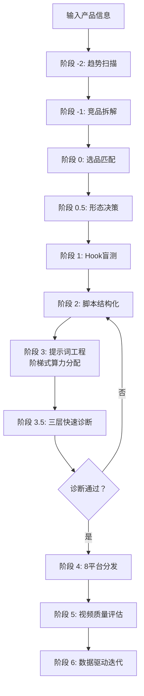

# TikTok 广告视频生成 Skill · Seedance 2.0 专用版

> **核心目标**：以最小成本、最高概率生成 TikTok/Reels/Shorts/Threads/Lemon8 全域爆款广告视频。

[](https://github.com/qq547820639/tiktok-ad-video-skill)
[](https://jimeng.jianying.com)
[](LICENSE.txt)


## ⚡ 30秒极简加载指南

1. 复制 `SKILL.md` 全部内容
2. 粘贴到 AI 对话框（DeepSeek 用户放入 System Prompt 设置区域）
3. 第一行加上：**“请严格按以下 Skill 工作流执行任务：”**
4. 发送后，输入你的产品信息，开始生成视频

**就这么简单。`SKILL.md` 是项目的唯一入口文件，已包含全部核心规则。**

如需深度扩展知识（完整Hook变体库、详细评分标准、失败案例库等），可额外加载 `references/` 目录下的 3 个文件。


## 📖 用户使用指南

### 第一步：了解项目结构

v3.0 已将项目从 14+ 个文件精简为 **5 个核心文件**：

| 文件 | 作用 | 是否必需 |
| :--- | :--- | :--- |
| `SKILL.md` | **唯一入口**：核心铁律、完整工作流、Hook速查、提示词规范、三层诊断、平台分发、常用指令 | ✅ 必需 |
| `references/core-knowledge.md` | 深度扩展：完整Hook变体库(40+)、电影词汇库、平台算法、评估校准、多语言策略 | 进阶推荐 |
| `references/narrative-playbook.md` | 叙事型软广详细模板(5种)+评论区运营+微短剧系列化方法论 | 美国市场推荐 |
| `references/failure-case-library.md` | 16 个典型失败案例与精准修复方案 | 按需查阅 |
| `README.md` | 项目说明（本文件） | 了解项目 |

### 第二步：输入产品信息

向加载了 Skill 的 AI 助手发送你的产品信息：

> “我卖 [产品名称]，核心卖点是 [一句话描述]，价格在 [价格区间]，目标客户是 [人群描述]。”

**示例**：
> “我卖铸铁元宝锅，无涂层物理不粘，价格 $29.9，目标客户是 25-45 岁家庭烹饪用户。”

### 第三步：参与Hook盲测

Skill 会输出 **3 个爆款Hook文案选项**（例如 A/B/C），请你凭直觉选择最能吸引你的一个。

### 第四步：获取生成资源

Skill 会根据你的选择和产品品类，输出：

1. **15 秒多镜头脚本**（含声音Hook、复播彩蛋、收藏引导、社交货币分享）
2. **Seedance 2.0 原子化分段提示词**（每段 30-60 词，单镜头单一运镜，正向锚点词）
3. **多平台发布指南**（含最佳发布时间和 AIGC 标签提醒）

### 第五步：三层快速诊断（积分风控 · 必做）

提交生成**之前**，Skill 自动进行三层诊断：

- **🔴 致命层**：Hook是否有视觉冲突？是否有声音Hook？ → 任一不通过，**禁止提交**
- **🟡 核心层**：垂直信号是否前 5 秒口述+字幕双出现？原生感是否启用？ → 不通过则警告+微调
- **🟢 卫生层**：是否含否定式负向词？是否超过 100 词/段？ → 自动修正

### 第六步：生成视频与分镜容错

1. 诊断通过后，将 **分段提示词** 逐段粘贴到即梦 AI，分别生成每个镜头。
2. **阶梯式算力分配**：镜头1（黄金Hook）用 Standard 模式，镜头2-4 用 Fast 模式。
3. 若某段翻车：**局部重生成**该段，保持色调一致，不推翻全部。
4. 在剪映中拼接各段，添加后期音效和字幕。

### 第七步：多平台分发与数据迭代

1. 按照生成的《多平台发布指南》，在最佳发布时间窗口发布到 8 个平台。
2. 发布 7 天后，告诉 Skill 视频表现，Skill 会**自动分析并调整后续策略**。


### 🚨 常见问题速查

| 问题 | 解决方法 |
| :--- | :--- |
| **Prompt 诊断不通过（致命层）** | 退回阶段 2，强化Hook和声音策略，无需消耗积分 |
| **前 3 秒不够抓人** | 启用声音Hook：前3秒纯 ASMR/音效，口播第3秒进入 |
| **Hook选错导致数据差** | 对照 `SKILL.md` §4 三维矩阵更换Hook |
| **播放量卡在 200-500** | 强化前3秒声音Hook，确认趋势热度阶段，增加收藏/分享引导 |
| **指令超长导致画面异常** | 改分段生成，每段≤100 词 |
| **某段生成翻车** | 局部重生成该段，保持色调一致（`SKILL.md` §7.3 容错协议） |
| **收藏率低** | 增加收藏引导话术 |
| **分享率低** | 对照品类更换社交货币类型 |
| **AI 味太重** | 启用原生感策略 |
| **美国市场播放量卡在 300** | 切换到叙事型软广（`SKILL.md` §5） |


## 🎯 一句话简介

这是一个为 **即梦 AI Seedance 2.0** 量身打造的、具备**自我迭代能力**的 TikTok 广告视频生成 Skill。单一文件入口，全内置核心规则，零外部依赖。


## ✨ v3.0 核心更新 (2026.05)

| 更新项 | 说明 |
| :--- | :--- |
| 📁 **项目结构精简** | 从 14+ 个文件精简为 5 个核心文件，SKILL.md 升级为全内置单文件入口 |
| 🎬 **阶梯式算力分配** | 镜头1（黄金Hook）用 Standard，镜头2-4 用 Fast，冷启动成本降低约 40% |
| 🛡️ **分镜容错与补偿协议** | 单镜头翻车只需局部重生成，不推翻全部，保持色调一致 |
| 📊 **性价比系数** | 新增 (预估播放量/消耗积分)×100 指标，系数<0.8 触发流程优化 |
| 🔗 **知识库深度整合** | references/ 从 14 个文件合并为 3 个（core-knowledge / narrative-playbook / failure-case-library） |
| 🚫 **SKILL-lite.md 移除** | 全内置功能已合并至 SKILL.md，消除双入口困惑 |


## 📁 仓库结构（v3.0 精简版）

```
tiktok-ad-video-skill/
├── SKILL.md                         # 🧠 唯一入口（全内置核心规则）
├── README.md                        # 📖 项目说明（本文件）
├── CHANGELOG.md                     # 📋 版本变更日志
├── LICENSE.txt                      # 📄 MIT 开源协议
├── product-tracker-template.md      # 📈 产品追踪模板
├── examples/
│   └── prompt-examples.md           # 📝 提示词示例
└── references/
    ├── core-knowledge.md            # 📚 深度知识库（Hook变体+词汇+平台+评估+多语言）
    ├── narrative-playbook.md        # 🎬 叙事型创作指南（剧本+评论区+微短剧）
    └── failure-case-library.md      # 🚨 失败案例库（16 个案例）
```


## 🧠 核心工作流




## 🔥 Hook三维匹配速查

| 品类 | ✅ 推荐Hook | 声音策略 | 趋势适配 |
| :--- | :--- | :--- | :--- |
| 锅具/厨房 | 视觉奇观/故事型 | 纯 ASMR 前 3 秒 | #cookinghack |
| 香水/美妆 | 场景共鸣 POV | 环境音，口播第 3 秒 | #selfcare |
| 清洁用品 | 认知失调型 | ASMR 擦拭声 | #cleaninghack |
| 收纳用品 | 极简结果型 | ASMR 物品归位声 | #homeorganization |
| 鞋服/百货 | 百搭展示/性价比反差 | 轻快旋律 + 价格字幕 | #OOTD |
| 3C/家电 | 痛点对比/技术下放 | 口播先入 + 对比画面 | #techreview |
| 食品饮料 | 视觉奇观/Adulting Win | ASMR 酥脆/爆浆声 | #foodtok |


## 📊 三层快速诊断（量化版）

| 层级 | 检查项 | 不通过动作 |
| :--- | :--- | :--- |
| 🔴 **致命层** | Hook是否有视觉冲突？是否有声音Hook？ | **禁止提交**，退回阶段 2 |
| 🟡 **核心层** | 垂直信号前5秒双出现？原生感启用？ | **警告 + 微调** |
| 🟢 **卫生层** | 是否含否定词？是否超100词/段？ | **自动修正** |


## 📊 核心功能速览

| 功能项 | 详情 |
| :--- | :--- |
| 视频格式 | 9:16 竖屏，15 秒（叙事型 45-60 秒） |
| 脚本结构 | 品类匹配多镜头模板（3-4 镜头） |
| 声音Hook | 前 3 秒 ASMR/音效优先，口播第 3 秒进入 |
| 提示词格式 | 原子化分段指令（每段 30-60 词，正向锚点词） |
| 算力分配 | 镜头1=Standard，镜头2-4=Fast |
| 支持平台 | TikTok、YouTube Shorts、IG/FB Reels、Threads、Lemon8、Pinterest、Snapchat |
| 预评估风控 | 三层快速诊断，致命层不通过禁止提交 |
| 容错机制 | 局部重生成协议，单镜头翻车不推翻全部 |
| 标准模式成本 | 120 积分/次 |
| Fast 模式成本 | 约 60-84 积分/次 |


## 🏆 实战验证

本 Skill 经过 **80+ 条视频** 的实战打磨：

- 铸铁锅：完播率 58%，分享率 11%（视觉奇观型 + ASMR 无油煎蛋声）
- 铸铁锅（叙事型）：1.2M 播放，评论率 4.2%（Mystery Object 悬念驱动）
- 清洁用品：完播率 62%，收藏率 14%（认知失调型 + 微距擦拭特写）
- 收纳鞋架：完播率 48%，收藏率 18%（极简结果型 + 免工具拼接展示）


## 📋 使用要求

- 即梦 AI 账号（[jimeng.jianying.com](https://jimeng.jianying.com)）及充足积分
- 浏览器自动化能力（用于提交生成任务）
- 对电商选品的基本理解


## 📄 开源协议

MIT License © 2026 — 详见 `LICENSE.txt` 获取完整条款。


**记住**：一个文件，全部规则。前 3 秒声音Hook比画面更重要。阶梯式算力，好钢用在刀刃上。致命层不通过绝不消耗积分。
