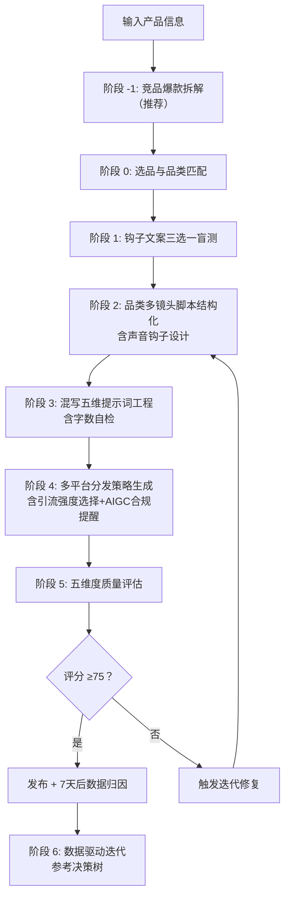

# TikTok 广告视频生成 Skill · Seedance 2.0 专用版

> **核心目标**：以最小成本、最高概率生成 TikTok/Reels/Shorts 全域爆款广告视频。

[](https://github.com/qq547820639/tiktok-ad-video-skill)
[](https://jimeng.jianying.com)
[](LICENSE.txt)


## ⚡ 30秒极简加载指南（着急的直接看这里）

1. 复制 `SKILL.md` 全部内容
2. 粘贴到 ChatGPT / Claude / DeepSeek 对话框
3. 第一行加上：**“请严格按以下 Skill 工作流执行任务：”**
4. 发送后，输入你的产品信息，开始生成视频

就这么简单。详细说明见下方「第一步」。


## 📖 用户使用指南

### 第一步：了解如何加载 Skill

本 Skill 由一个核心工作流文件（`SKILL.md`）和多个知识库文件（`references/` 目录）组成。**为了获得最佳效果，建议同时加载核心文件和知识库文件。**

#### 🚀 推荐加载方式

| 加载方式 | 需要提供的文件 | 效果 | 适用场景 |
| :--- | :--- | :--- | :--- |
| **完整加载（推荐）** | `SKILL.md` + `references/` 目录下全部文件 | AI 能自主查阅知识库，输出专业、精准、可复现 | 正式生产环境、长期高频使用 |
| **精简加载** | 仅 `SKILL.md` | AI 可运行基本流程，但输出依赖自身知识，质量不够稳定 | 快速测试、临时使用 |
| **按需加载** | 首次仅 `SKILL.md`，遇到具体问题时再提供对应 reference 文件 | 灵活省 token，但需要用户判断何时补充资料 | 有一定经验的用户 |

#### 📚 各文件作用一览

| 文件 | 作用 | 是否必需 |
| :--- | :--- | :--- |
| `SKILL.md` | **核心工作流**：角色定义、6 阶段流程、铁律与自迭代逻辑 | ✅ 必需 |
| `references/viral-hook-patterns.md` | 6 大钩子库 + 品类选型对照表 + 声音钩子策略 | 强烈推荐 |
| `references/cinematic-vocabulary.md` | 五维架构词汇表 + 混写指南 + Fast模式技巧 | 强烈推荐 |
| `references/evaluation-rubric.md` | 五维度评分标准 + 声音钩子执行度评估 | 强烈推荐 |
| `references/platform-specs.md` | 2026 各平台算法规则、AIGC标签要求 | 推荐 |
| `references/data-driven-iteration.md` | 数据驱动迭代指南，含诊断决策树 | 推荐 |
| `references/self-check-checklist.md` | 发布前自查清单，可打印 | 推荐 |
| `references/case-studies.md` | **新增**：5个品类实战案例，含迭代过程 | 推荐 |
| `references/failure-case-library.md` | 16 个典型失败案例与精准修复方案 | 按需 |
| `references/ab-testing-matrix.md` | A/B 测试模板 | 按需 |
| `references/ad-campaign-testing.md` | 广告创意测试指南 | 按需 |
| `references/localization-guide.md` | 出海本土化指南 | 按需 |


### 第二步：输入产品信息

向加载了 Skill 的 AI 助手发送你的产品信息。**最简单的输入方式**：

> “我卖 [产品名称]，核心卖点是 [一句话描述]，价格在 [价格区间]，目标客户是 [人群描述]。”

**示例**：
> “我卖罗莎琳德美甲灯，15颗灯珠秒干不黑手，价格 $8.85，目标客户是 18-35 岁 DIY 美甲爱好者。”

### 第三步：参与钩子盲选

Skill 会输出 **3 个爆款钩子文案选项**（例如 A/B/C），请你凭直觉选择最能吸引你的一个。

### 第四步：获取生成资源

Skill 会根据你的选择和产品品类，匹配最佳的多镜头叙事模板（3-4 个镜头），并输出：

1. **15 秒多镜头脚本**（含声音钩子、过程微距、复播彩蛋、收藏引导、社交货币分享）
2. **Seedance 2.0 完整提示词**（提供纯英文版和**混写版**——推荐使用混写版）
3. **多平台发布指南**（包含各平台标题、标签、互动话术、AIGC标签提醒）

### 第五步：生成视频

1. 打开即梦 AI 的 **文生视频** 功能。
2. 将 Skill 输出的 **混写版提示词**（推荐）或纯英文提示词粘贴到输入框。
3. 选择 **Seedance 2.0 模型**，时长选择 **15 秒**，比例选择 **9:16**。
4. **测试阶段建议选择 Fast 模式**（成本降低 30%-50%，约 60-84 积分/次）。
5. 点击生成，下载生成的视频。

### 第六步：发布前自查与数据迭代

1. **发布前**：对照 `references/self-check-checklist.md` 逐项检查（声音钩子、品类钩子匹配、AIGC标签等）。
2. **发布后 7 天**：根据数据表现，参考 `references/data-driven-iteration.md` 决策树执行迭代动作。


### 🚨 常见问题速查

| 问题 | 解决方法 |
| :--- | :--- |
| **前 3 秒不够抓人** | 启用声音钩子：前3秒纯 ASMR/音效，口播第3秒进入 |
| **钩子选错导致数据差** | 对照 `viral-hook-patterns.md` 品类选型对照表换钩子 |
| **新视频播放量卡在 200-500** | 强化前3秒声音钩子，确认钩子类型符合品类，增加收藏/分享引导 |
| **完播率低，中间划走** | 检查多镜头结构，增加 `Snappy motion, Quick cuts` |
| **收藏率低** | 增加收藏引导话术：`Save for your next ___` |
| **分享率低** | 对照品类更换社交货币类型（展现品味/展示专业/圈层归属） |
| **AI 味太重** | 启用原生感策略：`真实素人反应` / `自然窗光` / `生活化杂乱背景` |
| **视频被限流** | 检查是否勾选平台 AIGC 标签 |
| **不知道如何根据数据迭代** | 参考 `data-driven-iteration.md` 决策树 |
| **想生成英文/其他语言视频** | 在输入产品信息时注明“全局英文”，Skill 会自动切换语言；深度本土化参考 `references/localization-guide.md` |


## 🎯 一句话简介

这是一个为 **即梦 AI Seedance 2.0** 量身打造的、具备**自我迭代能力**的 TikTok 广告视频生成 Skill。通过“钩子预判 → 图文盲测 → 品类多镜头脚本 → 混写五维提示词 → 多平台分发 → 五维评估 → 数据驱动迭代”闭环，帮助你在 2026 年的短视频算法环境下，用最少的积分消耗，跑出最高的爆款概率。


## ✨ v2.9 核心更新 (2026.05)

| 更新项 | 说明 |
| :--- | :--- |
| ⚡ **30秒极简加载指南** | README 新增极简版加载步骤，降低新手入门门槛 |
| 🔴🟢 **引流强度选择模式** | SKILL.md 阶段4新增软植入/强引流两种模式，适配不同投放场景 |
| 📚 **实战案例集** | 新增 `references/case-studies.md`，收录铸铁锅、鞋架、不锈钢盆等5个品类实战案例 |
| 🌐 **出海场景前置** | 常见问题新增英文/多语言生成入口，本土化指南更易触达 |
| 📦 **批量生成模式说明** | SKILL.md 新增多产品批量生成提示，提升效率 |
| ✂️ **提示词字数自检** | SKILL.md 阶段3增加即梦AI 2000字符限制自动检查 |


## 📁 仓库结构

```
tiktok-ad-video-skill/
├── SKILL.md                         # 🧠 核心工作流（必需）
├── README.md                        # 📖 项目说明（本文件）
├── CHANGELOG.md                     # 📋 版本变更日志
├── LICENSE.txt                      # 📄 MIT 开源协议
├── evaluation-rubric.md             # 📊 五维度评分表
├── product-tracker-template.md      # 📈 产品追踪模板（可选）
├── examples/
│   └── prompt-examples.md           # 📝 提示词示例
└── references/
    ├── viral-hook-patterns.md       # 🔥 钩子库 + 品类选型对照表 + 声音钩子
    ├── cinematic-vocabulary.md      # 🎬 五维架构词汇 + 混写指南
    ├── platform-specs.md            # 📱 2026 平台算法 + AIGC标签
    ├── evaluation-rubric.md         # 📊 五维度评分表（v2.8）
    ├── data-driven-iteration.md     # 📈 数据驱动迭代指南
    ├── self-check-checklist.md      # ✅ 发布前自查清单
    ├── case-studies.md              # 📚 实战案例集（新增）
    ├── failure-case-library.md      # 🚨 16 个失败案例
    ├── ab-testing-matrix.md         # 🧪 A/B 测试矩阵
    ├── ad-campaign-testing.md       # 📊 广告创意测试
    └── localization-guide.md        # 🌍 出海本土化指南
```


## 🧠 核心工作流（6 个阶段）




## 🔥 六大爆款钩子类型

| 钩子类型 | 核心心理触发点 | 适用产品 | 推荐镜头模板 | 声音钩子示例 |
| :--- | :--- | :--- | :--- | :--- |
| **认知失调型** | 违背常识、打破预期 | 清洁神器、黑科技 | 功能效果型 (4镜头) | ASMR 擦拭声 |
| **极简结果型** | 懒惰红利、一步到位 | 收纳、厨房工具 | 极简结果型 (3镜头) | ASMR 物品归位声 |
| **价格锚点型** | 占便宜心理、价值错位 | 百货、服饰 | 高性价比型 (4镜头) | 收银机叮声 |
| **情感绑架型** | 愧疚感、爱与被爱 | 礼品、护理 | 情感共鸣型 (4镜头) | 温馨环境音 |
| **视觉奇观型** | 解压、ASMR | 食品、锅具 | 功能效果型 (4镜头) | ASMR 煎炸/爆浆声 |
| **身份认同型** | 圈层归属、社交标签 | 垂直品类 | 极简结果型 (3镜头) | 环境音+轻快节奏 |


## 📊 五维度质量评估体系

| 维度 | 分值 | 核心指标 |
| :--- | :--- | :--- |
| **技术质量** | 20 分 | 画面清晰度 + 运镜质感 + AI瑕疵控制 |
| **爆款钩子** | 30 分 | 前3秒留存（含声音钩子） + 完播潜力 + 复播引导 |
| **平台适配** | 20 分 | 收藏引导力 + 社交货币分享 + 垂直领域信号 + 各平台适配 |
| **导演执行** | 15 分 | 五维架构 + 原生感 + 声音钩子执行度 + 多镜头结构 + 音频同步 + 转场 |
| **算法信号** | 15 分 | 复播率预估 + 收藏率预估 + 分享率预估 |
| **总分** | **100 分** | ≥75 发布 / 60-74 优化 / <60 废弃 |


## 🔄 数据驱动迭代机制

1. **发布后 7 天** → 回看数据
2. **播放量 < 200，前 3 秒留存 < 40%** → 换钩子类型（对照品类选型表）
3. **播放量 500-2000，完播率 30-50%** → 微调卖点顺序 + 强化评论区互动
4. **播放量 > 2000，完播率 > 50%** → 复制脚本结构，换品再做
5. **连续 3 次验证** → 更新 Skill 内部权重


## 📊 核心功能速览

| 功能项 | 详情 |
| :--- | :--- |
| 视频格式 | 9:16 竖屏，15 秒 |
| 脚本结构 | 品类匹配多镜头模板（3-4 镜头） |
| 声音钩子 | 前 3 秒 ASMR/音效优先，口播第 3 秒进入 |
| 引流强度 | 软植入型 / 强引流型 可选 |
| 提示词格式 | 混写版（中文意境 + 英文精准指令） |
| 默认风格 | 原生感（UGC风格） |
| 支持平台 | TikTok、Meta、YouTube Shorts、Pinterest、Snapchat |
| 标准模式成本 | 120 积分/次 |
| Fast 模式成本 | 约 60-84 积分/次 |


## 🏆 实战验证

本 Skill 经过 **80+ 条视频、8+ 个生产日** 的实战打磨，详见 `references/case-studies.md`：

- 铸铁锅：完播率 58%，分享率 11%（视觉奇观型 + ASMR 无油煎蛋声 + 强引流版）
- 清洁用品：完播率 48%，收藏率 12%（功能效果型 4 镜头 + ASMR 擦拭声）
- 美甲灯：完播率 52%，收藏率 15%（高性价比型 4 镜头 + 展现品味型社交货币）
- 简易鞋架：4镜头快节奏，免工具安装卖点轰炸
- 不锈钢盆：一物多用展示，食品级材质打标


## 📋 使用要求

- 即梦 AI 账号（[jimeng.jianying.com](https://jimeng.jianying.com)）及充足积分
- 浏览器自动化能力（用于提交生成任务）
- 对电商选品的基本理解


## 📄 开源协议

MIT License © 2026 — 详见 `LICENSE.txt` 获取完整条款。


**记住**：前 3 秒声音钩子比画面更重要；钩子选错满盘皆输；数据是最好的导演。
