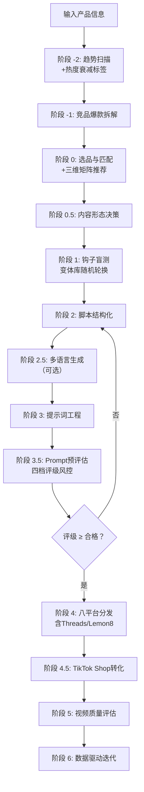

# TikTok 广告视频生成 Skill · Seedance 2.0 专用版

> **核心目标**：以最小成本、最高概率生成 TikTok/Reels/Shorts/Threads/Lemon8 全域爆款广告视频。

[](https://github.com/qq547820639/tiktok-ad-video-skill)
[](https://jimeng.jianying.com)
[](LICENSE.txt)


## ⚡ 30秒极简加载指南（着急的直接看这里）

1. 复制 `SKILL.md` 全部内容（或使用精简版 `SKILL-lite.md` 节省 Token）
2. 粘贴到 ChatGPT / Claude / DeepSeek 对话框
3. 第一行加上：**“请严格按以下 Skill 工作流执行任务：”**
4. 发送后，输入你的产品信息，开始生成视频

就这么简单。详细说明见下方「第一步」。


## 📖 用户使用指南

### 第一步：了解如何加载 Skill

本 Skill 由一个核心工作流文件（`SKILL.md`）和多个知识库文件（`references/` 目录）组成。**为了获得最佳效果，建议同时加载核心文件和知识库文件。**

#### 🚀 推荐加载方式

| 加载方式 | 需要提供的文件 | 效果 | 适用场景 |
| :--- | :--- | :--- | :--- |
| **完整加载（推荐）** | `SKILL.md` + `references/` 目录下全部文件 | AI 能自主查阅知识库，输出专业、精准、可复现 | 正式生产环境、长期高频使用 |
| **精简加载** | `SKILL-lite.md`（仅含核心工作流+评分表+钩子库） | Token 消耗减少约 60%，覆盖 80% 常见场景 | 快速测试、Token 敏感场景 |
| **按需加载** | 首次仅 `SKILL.md`，遇到具体问题时再提供对应 reference 文件 | 灵活省 token，但需要用户判断何时补充资料 | 有一定经验的用户 |

#### 📚 各文件作用一览

| 文件 | 作用 | 是否必需 |
| :--- | :--- | :--- |
| `SKILL.md` | **核心工作流（v2.14）**：角色定义、8 阶段流程、趋势感知、多语言生成、全平台分发 | ✅ 必需 |
| `SKILL-lite.md` | **精简版**：Token 友好，仅含核心工作流+评分表+钩子库 | 推荐（快速测试） |
| `references/viral-hook-patterns.md` | 7 大钩子库 + 三维匹配矩阵（品类×钩子×趋势）+ 40+ 变体库 | 强烈推荐 |
| `references/narrative-ad-playbook.md` | 叙事型软广剧本指南（5种模板+评论区运营） | 美国市场推荐 |
| `references/cinematic-vocabulary.md` | 五维架构词汇表 + 混写指南 + Fast模式技巧 | 强烈推荐 |
| `references/evaluation-rubric.md` | 五维度评分表 + Prompt预评估四档评级 | 强烈推荐 |
| `references/localization-script-guide.md` | **v2.14 新增**：多语言本土化指南（7种语言） | 出海市场推荐 |
| `references/platform-specs.md` | **v2.14 更新**：8 平台算法规则（含 Threads/Lemon8） | 推荐 |
| `references/calibration-guide.md` | 评分权重校准指南（含手动方法和 Python 脚本） | 进阶用户 |
| `references/content-calendar-template.md` | 内容日历模板（单产品/多产品/A/B测试排期） | 按需 |
| `references/competitor-analysis-template.md` | 竞品爆款拆解模板（含共性提取+差异化策略） | 按需 |
| `references/case-studies.md` | **v2.14 重构**：按品类组织的实战案例库（成功+失败+可复用公式） | 推荐 |
| `references/failure-case-library.md` | 16 个典型失败案例与精准修复方案 | 按需 |
| `references/ab-testing-matrix.md` | A/B 测试模板 | 按需 |
| `references/ad-campaign-testing.md` | 广告创意测试指南 | 按需 |
| `references/localization-guide.md` | 出海本土化指南（文化禁忌、节日营销等） | 按需 |

#### 💡 如何加载到 AI 助手

**如果你使用的是 ChatGPT / Claude / DeepSeek 等通用 AI**：
1. 打开对话窗口。
2. 将推荐加载的文件内容**全部复制**，粘贴到输入框。
3. 在内容前加上一句提示语：
   > *"请仔细阅读以下 Skill 文档和知识库，并严格按照其中的方法论、工作流和评分标准来执行任务。在收到我的产品信息后，请按照工作流为我生成广告视频。"*

**如果你使用的是 Dify / Coze / GPTs 等支持知识库的平台**：
1. 将 `SKILL.md` 设置为系统提示词（System Prompt）。
2. 将 `references/` 目录整体上传为知识库，AI 会在运行时自动检索相关文档。


### 第二步：输入产品信息

向加载了 Skill 的 AI 助手发送你的产品信息。**最简单的输入方式**：

> “我卖 [产品名称]，核心卖点是 [一句话描述]，价格在 [价格区间]，目标客户是 [人群描述]。”

**示例**：
> “我卖罗莎琳德美甲灯，15颗灯珠秒干不黑手，价格 $8.85，目标客户是 18-35 岁 DIY 美甲爱好者。”

### 第三步：参与钩子盲选

Skill 会输出 **3 个爆款钩子文案选项**（例如 A/B/C），请你凭直觉选择最能吸引你的一个。

### 第四步：获取生成资源

Skill 会根据你的选择和产品品类，匹配最佳的多镜头叙事模板（3-4 个镜头），并输出：

1. **15 秒多镜头脚本**（含声音钩子、过程微距、复播彩蛋、收藏引导、社交货币分享）
2. **Seedance 2.0 完整提示词**（提供纯英文版和**混写版**——推荐使用混写版）
3. **多平台发布指南**（TikTok/Shorts/Reels/**Threads/Lemon8**/Pinterest/Snapchat）

### 第五步：Prompt 预评估（积分风控 · 必做）

在将提示词提交给即梦 AI **之前**，Skill 会自动进行 **Prompt 文本预评估**。

- **五维度打分**：前3秒钩子强度(30分) / 声音策略明确度(25分) / 垂直领域信号(20分) / 原生感设计(15分) / 去AI味指令(10分)
- **四档评级**：
  - ✅ **优秀（≥85分）**：可直接提交生成
  - ⚠️ **合格（80-84分）**：允许提交，建议微调
  - 🔄 **需小修（70-79分）**：必须优化后重评
  - ❌ **需大修（<70分）**：建议重新选择钩子方向
- **核心原则**：**预评估不通过，绝不消耗积分**。

### 第六步：生成视频

1. 预评估通过后，打开即梦 AI 的 **文生视频** 功能。
2. 将 Skill 输出的 **混写版提示词**（推荐）粘贴到输入框。
3. 选择 **Seedance 2.0 模型**，时长选择 **15 秒**，比例选择 **9:16**。
4. **冷启动测试阶段建议选择 Fast 模式**（约 60-84 积分/次）。
5. 点击生成，下载生成的视频。

### 第七步：多平台分发与数据迭代

1. **分发**：按照生成的《多平台发布指南》，将视频发布到 TikTok、Reels、Shorts、**Threads、Lemon8** 等平台。
2. **数据反馈**：发布 7 天后，回到对话中告诉 Skill 视频表现（播放量、完播率、收藏率、分享率），Skill 会**自动分析并调整后续策略**。
3. **校准优化**：累计 20+ 条视频数据后，可使用 `calibration-guide.md` 校准评分权重。


### 🚨 常见问题速查

| 问题 | 解决方法 |
| :--- | :--- |
| **Prompt 预评估不通过（<80分）** | 根据评级（需小修/需大修）退回对应阶段优化，无需消耗积分 |
| **前 3 秒不够抓人** | 启用声音钩子：前3秒纯 ASMR/音效，口播第3秒进入 |
| **钩子选错导致数据差** | 对照 `viral-hook-patterns.md` 三维矩阵（品类×钩子×趋势）更换钩子 |
| **新视频播放量卡在 200-500** | 强化前3秒声音钩子，确认趋势热度阶段（避免踩中衰退趋势），增加收藏/分享引导 |
| **完播率低，中间划走** | 检查多镜头结构，增加 `Snappy motion, Quick cuts` |
| **收藏率低** | 增加收藏引导话术：`Save for your next ___` |
| **分享率低** | 对照品类更换社交货币类型（展现品味/展示专业/圈层归属） |
| **AI 味太重** | 启用原生感策略：`真实素人反应` / `自然窗光` / `生活化杂乱背景` |
| **视频被限流** | 检查是否勾选平台 AIGC 标签（各平台标签名不同） |
| **不知道如何根据数据迭代** | 参考 `data-driven-iteration.md` 决策树 |
| **想生成英文/其他语言视频** | 在输入产品信息时注明“全局英文”；或使用阶段 2.5 多语言生成（覆盖7种语言） |
| **想覆盖 Threads/Lemon8** | Skill 会自动输出这两平台的分发文案和封面策略 |
| **美国市场播放量卡在 300** | 切换到叙事型软广，参考 `narrative-ad-playbook.md` |


## 🎯 一句话简介

这是一个为 **即梦 AI Seedance 2.0** 量身打造的、具备**自我迭代能力**的 TikTok 广告视频生成 Skill。通过“趋势扫描 → 竞品拆解 → 钩子盲测 → 品类多镜头脚本 → 多语言生成 → 混写五维提示词 → Prompt预评估风控 → 八平台分发 → 五维评估 → 数据驱动迭代”闭环，在 2026 年的短视频算法环境下，用最少的积分消耗，跑出最高的爆款概率。


## ✨ v2.14 核心更新 (2026.05)

| 更新项 | 说明 |
| :--- | :--- |
| 🔥 **趋势热度衰减机制** | 阶段 -2 新增趋势热度阶段标签（🚀上升期/📊稳定期/📉衰减期/⚰️衰退期），衰减趋势自动警告并推荐替代 |
| 🌍 **多语言本土化生成（阶段 2.5）** | 新增 7 种语言全覆盖，本地化视频素材复用，制作成本趋近于零 |
| 🧵🍋 **全平台矩阵（8 平台）** | 新增 Threads 和 Lemon8 完整规格，实现一条素材八端分发 |
| 📚 **案例库品类化重构** | 按锅具/清洁/收纳/美妆等品类重组，新增失败案例对照和可复用公式 |
| ⚡ **AI 工具链集成建议** | 推荐 AI 配音、字幕、翻译工具，降低多语言测试成本 |


## 📁 仓库结构（v2.14）

```
tiktok-ad-video-skill/
├── SKILL.md                         # 🧠 核心工作流（v2.14）
├── SKILL-lite.md                    # ⚡ 精简版（Token友好）
├── README.md                        # 📖 项目说明（本文件）
├── CHANGELOG.md                     # 📋 版本变更日志（v2.14）
├── LICENSE.txt                      # 📄 MIT 开源协议
├── evaluation-rubric.md             # 📊 五维度评分表 + Prompt预评估
├── product-tracker-template.md      # 📈 产品追踪模板
├── examples/
│   └── prompt-examples.md           # 📝 提示词示例
└── references/
    ├── viral-hook-patterns.md       # 🔥 钩子库+三维矩阵+变体库（v2.13）
    ├── narrative-ad-playbook.md     # 🎬 叙事型软广剧本指南（v1.1）
    ├── cinematic-vocabulary.md      # 🎬 五维架构词汇+混写指南
    ├── platform-specs.md            # 📱 8 平台算法+Threads/Lemon8（v2.14）
    ├── evaluation-rubric.md         # 📊 评分表（v2.12）
    ├── localization-script-guide.md # 🌍 多语言本土化指南（v1.0，新增）
    ├── calibration-guide.md         # 📈 评分校准指南（v1.0）
    ├── competitor-analysis-template.md # 🔍 竞品拆解模板（v1.0）
    ├── content-calendar-template.md # 📅 内容日历模板（v1.0）
    ├── data-driven-iteration.md     # 📈 数据驱动迭代指南
    ├── self-check-checklist.md      # ✅ 发布前自查清单
    ├── case-studies.md              # 📚 实战案例库（v2.14，按品类）
    ├── failure-case-library.md      # 🚨 失败案例库
    ├── ab-testing-matrix.md         # 🧪 A/B测试矩阵
    ├── ad-campaign-testing.md       # 📊 广告创意测试
    └── localization-guide.md        # 🌍 出海本土化指南
```


## 🧠 核心工作流（v2.14 增强版）




## 🔥 三维匹配矩阵速查（部分示例）

| 品类 | ✅ 推荐钩子 | 声音策略 | 趋势适配建议 |
| :--- | :--- | :--- | :--- |
| 锅具/厨房 | 视觉奇观/故事型 | 纯 ASMR 前3秒 | #cookinghack + 治愈系烹饪音频 |
| 香水/美妆 | 场景共鸣 POV | 环境音，口播第3秒 | #selfcare 音频 + 季节性主题 |
| 清洁用品 | 认知失调型 | ASMR 擦拭声 | #cleaninghack + 强迫症舒适音频 |
| 收纳用品 | 极简结果型 | 轻快节奏音 | #homeorganization + 收纳改造话题 |


## 📊 Prompt 预评估四档评级体系

| 总分区间 | 评级 | 执行动作 |
| :--- | :--- | :--- |
| **≥ 85 分** | ✅ 优秀 | 可直接提交生成 |
| **80-84 分** | ⚠️ 合格 | 允许提交，建议微调 |
| **70-79 分** | 🔄 需小修 | 必须退回优化 |
| **< 70 分** | ❌ 需大修 | 建议重新选择钩子 |

> **非线性惩罚**：钩子强度(H)或声音策略(A)低于 50 分，评级自动降一档。


## 📊 核心功能速览

| 功能项 | 详情 |
| :--- | :--- |
| 视频格式 | 9:16 竖屏，15 秒（叙事型 45-60 秒） |
| 脚本结构 | 品类匹配多镜头模板（3-4 镜头） |
| 声音钩子 | 前 3 秒 ASMR/音效优先，口播第 3 秒进入 |
| 趋势感知 | 阶段 -2 实时扫描 + 四档热度衰减标签 |
| 多语言 | 7 种语言全覆盖，视频画面复用 |
| 引流强度 | 软植入型 / 强引流型 / 叙事型零提及 |
| 支持平台 | TikTok、YouTube Shorts、IG Reels、Facebook Reels、**Threads、Lemon8**、Pinterest、Snapchat |
| 预评估风控 | 四档评级，<80 分禁止提交 |
| 标准模式成本 | 120 积分/次 |
| Fast 模式成本 | 约 60-84 积分/次 |


## 🏆 实战验证

本 Skill 经过 **80+ 条视频、8+ 个生产日** 的实战打磨，详见 `references/case-studies.md`（v2.14 按品类重构）：

- 铸铁锅：完播率 58%，分享率 11%（视觉奇观型 + ASMR 无油煎蛋声）
- 铸铁锅（叙事型）：1.2M 播放，评论率 4.2%（Mystery Object 悬念驱动）
- 清洁用品：完播率 62%，收藏率 14%（认知失调型 + 微距擦拭特写）
- 收纳鞋架：完播率 48%，收藏率 18%（极简结果型 + 免工具拼接展示）


## 📋 使用要求

- 即梦 AI 账号（[jimeng.jianying.com](https://jimeng.jianying.com)）及充足积分
- 浏览器自动化能力（用于提交生成任务）
- 对电商选品的基本理解


## 📄 开源协议

MIT License © 2026 — 详见 `LICENSE.txt` 获取完整条款。


**记住**：前 3 秒声音钩子比画面更重要；趋势踩对事半功倍，踩中衰退趋势反噬流量；预评估不通过绝不消耗积分；数据是最好的导演。
