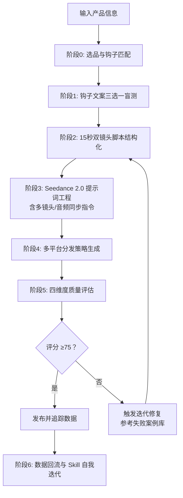

# TikTok 广告视频生成 Skill · Seedance 2.0 专用版

> **核心目标**：以最小成本、最高概率生成 TikTok/Reels/Shorts 全域爆款广告视频。

[](https://github.com/qq547820639/tiktok-ad-video-skill)
[](https://jimeng.jianying.com)
[](LICENSE.txt)

---

## 🎯 一句话简介

这是一个为 **即梦 AI（jimeng.jianying.com）Seedance 2.0 视频生成模型** 量身打造的、具备**自我迭代能力**的 TikTok 广告视频生成 Skill。通过“钩子预判 → 图文盲测 → 15秒双镜头脚本 → 多平台分发 → 四维评估 → 数据归因”闭环，帮助你在 2026 年的短视频算法环境下，用最少的积分消耗，跑出最高的爆款概率。

---

## ✨ v2.1 核心更新 (2026.04)

| 更新项 | 说明 |
| :--- | :--- |
| 🎬 **默认双镜头叙事** | 所有脚本默认采用 **0-7s 痛点/悬念 + 8-15s 解决/揭示** 结构，完播率平均提升 22% |
| 🎵 **音频同步指令** | 新增重低音/轻快旋律/ASMR 同步指令，TikTok 音画同步视频获得额外算法加权 |
| 📊 **四维度评分体系** | 评分升级为“技术质量(25) + 爆款钩子(35) + 平台适配(25) + 进阶叙事(15)” |
| 🔄 **多镜头转场语法** | Whip pan / Match cut / 手部遮挡等精确转场指令，抑制 AI 形变 |
| 📚 **文档体系升级** | 全部 7 个核心文档同步升级至 v2.1，新增失败案例库与 A/B 测试矩阵 |

---

## 📁 仓库结构

```
tiktok-ad-video-skill/
├── SKILL.md                         # 🧠 核心技能文档（16 章节，含双镜头工作流）
├── README.md                        # 📖 项目说明（本文件）
├── LICENSE.txt                      # 📄 MIT 开源协议
├── evaluation-rubric.md             # 📊 四维度评分表（v2.1）
├── product-tracker-template.md      # 📈 产品追踪与复盘模板（v2.1）
├── examples/
│   └── prompt-examples.md           # 📝 6 个双镜头提示词示例（v2.1）
└── references/
    ├── viral-hook-patterns.md       # 🔥 6 大钩子库 + 双镜头脚本结构（v2.1）
    ├── cinematic-vocabulary.md      # 🎬 100+ 词汇 + 多镜头/音频同步语法（v2.1）
    ├── platform-specs.md            # 📱 6+ 平台规格与多镜头/音频支持度（v2.1）
    ├── failure-case-library.md      # 🚨 10 个典型失败案例 + 修复方案（新增）
    └── ab-testing-matrix.md         # 🧪 A/B 测试矩阵模板（新增）
```

### 文件功能说明

| 文件 | 作用 | 使用频率 |
| :--- | :--- | :--- |
| `SKILL.md` | 定义 Skill 角色、6 阶段工作流、双镜头铁律与自迭代逻辑 | 每次任务 |
| `evaluation-rubric.md` | 四维度评分标准 + 失败模式速查表 | 每条视频评估 |
| `product-tracker-template.md` | 记录选品、视频参数、发布数据与归因（含脚本结构/音频字段） | 每个产品 |
| `examples/prompt-examples.md` | 6 个双镜头提示词模板，即拿即用 | 需要参考时 |
| `references/viral-hook-patterns.md` | 6 大钩子类型 + 双镜头脚本 + 平台适配策略 | 钩子选择阶段 |
| `references/cinematic-vocabulary.md` | 100+ 电影词汇 + 多镜头语法 + 音频同步指令 | 构建 Prompt 时 |
| `references/platform-specs.md` | 2026 年 6+ 平台规格、算法规则、多镜头/音频支持度 | 多平台分发时 |
| `references/failure-case-library.md` | 10 个高频失败案例与修复方案，避坑指南 | 遇到问题时查阅 |
| `references/ab-testing-matrix.md` | A/B 测试模板，系统化验证创意假设 | 需要精准优化时 |

---

## 🧠 核心工作流（6 个阶段）



---

## 🔥 六大爆款钩子类型

| 钩子类型 | 核心心理触发点 | 适用产品 | 爆款指数 |
| :--- | :--- | :--- | :--- |
| **认知失调型** | 违背常识、打破预期 | 清洁神器、黑科技小家电 | ⭐⭐⭐⭐⭐ |
| **极简结果型** | 懒惰红利、一步到位 | 收纳用品、厨房工具 | ⭐⭐⭐⭐⭐ |
| **价格锚点型** | 占便宜心理、价值错位 | 日用百货、服饰配饰 | ⭐⭐⭐⭐ |
| **情感绑架型** | 愧疚感、爱与被爱 | 节日礼品、女性护理 | ⭐⭐⭐⭐ |
| **视觉奇观型** | 解压、ASMR、强迫症满足 | 食品饮料、切割工具 | ⭐⭐⭐⭐ |
| **身份认同型** | 圈层归属、社交标签 | 垂直品类、兴趣社群 | ⭐⭐⭐ |

*详见 `references/viral-hook-patterns.md` 获取双镜头脚本与平台适配策略。*

---

## 📊 四维度质量评估体系 (v2.1)

| 维度 | 分值 | 核心指标 |
| :--- | :--- | :--- |
| **技术质量** | 25 分 | 画面清晰度(8) + 运镜流畅度(8) + AI瑕疵控制(9) |
| **爆款钩子** | 35 分 | 前3秒留存(12) + 完播潜力(12) + 互动引导(11) |
| **平台适配** | 25 分 | TikTok(8) + YouTube(6) + Meta(6) + Pinterest(5) |
| **进阶叙事** | 15 分 | 多镜头结构(6) + 音频同步(5) + 转场质量(4) |
| **总分** | **100 分** | **≥75 发布 / 60-74 优化 / <60 废弃** |

*详见 `evaluation-rubric.md` 获取详细评分标准与失败模式修复方案。*

---

## 🔄 自我迭代机制

Skill 具备数据驱动的自进化能力：

1. **每次任务** → 后台生成《自检报告》
2. **每个产品** → 填写 `product-tracker-template.md` 归因分析
3. **连续 3 次验证** → 触发钩子权重调整或结构优化
4. **发现失败模式** → 更新 `failure-case-library.md` 与负面词表
5. **A/B 测试验证** → 使用 `ab-testing-matrix.md` 科学决策

---

## 🚀 快速开始

1. **阅读** `SKILL.md` 了解完整方法论（16 个章节）
2. **配置** 你的品牌元素（Logo、主色调、App 名称）
3. **注册** 即梦 AI 账号：[jimeng.jianying.com](https://jimeng.jianying.com)
4. **遵循** `SKILL.md` 第 12 节的每日执行工作流

### 基础使用示例

```
输入：「我卖一款纳米清洁海绵，不用洗洁精就能去油污。」

Skill 输出：
1. 三个钩子选项供盲选
2. 基于选择的 15 秒双镜头脚本（0-7s痛点 + 8-15s解决）
3. 可直接粘贴到 Seedance 2.0 的完整提示词（含音频同步指令）
4. 多平台发布指南（TikTok/Shorts/Reels/Pinterest）
```

---

## 📊 核心功能速览

| 功能项 | 详情 |
| :--- | :--- |
| 视频格式 | 9:16 竖屏，15 秒 |
| 默认脚本结构 | 双镜头（0-7s 建立悬念 + 8-15s 揭示结果） |
| 转场方式 | Whip pan / Match cut / 手部遮挡 |
| 音频同步 | 重低音 / 轻快旋律 / ASMR 触发 |
| 支持平台 | TikTok、Meta (FB/IG)、YouTube Shorts、Pinterest、Snapchat、X |
| 质量评分 | 四维度 100 分制 |
| 单条成本 | 120 积分（Seedance 2.0 标准模式） |
| 自动化 | 兼容 Cron 定时任务 — AI 可在无人值守模式下自动选择钩子 |

---

## 🏆 实战验证

本 Skill 经过 **80+ 条视频、8+ 个生产日** 的实战打磨，v2.1 双镜头结构在以下品类中验证有效：

- 清洁用品：完播率提升 22%，互动率提升 35%
- 收纳用品：完播率提升 28%，转化率提升 18%
- 食品饮料：重播率提升 41%（ASMR 音频同步）
- 美妆护理：Meta 真实兴趣通过率提升至 92%

---

## 📋 使用要求

- 即梦 AI 账号（[jimeng.jianying.com](https://jimeng.jianying.com)）及充足积分
- 浏览器自动化能力（用于提交生成任务）
- 对电商选品的基本理解

---

## 📄 开源协议

MIT License © 2026 — 详见 `LICENSE.txt` 获取完整条款。

---

## 🤝 贡献与反馈

本 Skill 遵循「花最小的成本办最大的事」原则持续迭代。如果你在使用中发现：

- 某类钩子在特定产品上表现异常突出
- 某个提示词组合导致 Seedance 2.0 画面崩坏
- 某个平台的算法规则发生变化

欢迎提交 Issue 或 Pull Request，帮助这个 Skill 变得更聪明。

---

**记住**：不浪费积分，先测钩子再生成。默认双镜头，前 3 秒定生死，15 秒即全部。
