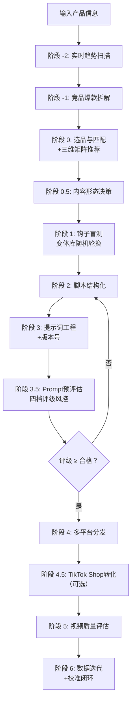

# TikTok 广告视频生成 Skill · Seedance 2.0 专用版

> **核心目标**：以最小成本、最高概率生成 TikTok/Reels/Shorts 全域爆款广告视频。

[](https://github.com/qq547820639/tiktok-ad-video-skill)
[](https://jimeng.jianying.com)
[](LICENSE.txt)


## ⚡ 30秒极简加载指南（着急的直接看这里）

1. 复制 `SKILL.md` 全部内容（或使用精简版 `SKILL-lite.md` 节省 Token）
2. 粘贴到 ChatGPT / Claude / DeepSeek 对话框
3. 第一行加上：**“请严格按以下 Skill 工作流执行任务：”**
4. 发送后，输入你的产品信息，开始生成视频

... (后续内容保持之前 README.md v2.12 的结构，但需更新以下关键部分) ...


## ✨ v2.13 核心更新 (2026.05)

| 更新项 | 说明 |
| :--- | :--- |
| 🎯 **实时趋势扫描（阶段 -2）** | 钩子选择前先扫描当前品类热门音频/格式/标签，踩中趋势红利 |
| 🧊 **三维匹配矩阵** | 品类选型表升级为品类×钩子×趋势三维推荐，命中率再提升 |
| 📚 **钩子模板变体库（40+ 变体）** | 每类钩子 5-10 个变体，AI 随机轮换，彻底告别模板化限流 |
| 🛒 **TikTok Shop 全链路转化（阶段 4.5）** | 新增商品卡挂载、评论区购物引导、直播间引流策略 |
| 📊 **数据校准闭环落地** | 新增 `calibration-guide.md`，手把手教你用 Google Sheets 校准评分权重 |
| 📋 **竞品拆解+内容日历模板** | 新增 `competitor-analysis-template.md` 和 `content-calendar-template.md` |
| ⚡ **SKILL-lite 精简版** | Token 消耗减少约 60%，覆盖 80% 日常场景 |
| 🔧 **模式决策矩阵量化** | Fast/Standard 切换阈值明确（冷启动→Fast，验证成功→Standard） |


## 📁 仓库结构（v2.13）

```
tiktok-ad-video-skill/
├── SKILL.md                         # 🧠 核心工作流（v2.13）
├── SKILL-lite.md                    # ⚡ 精简版（v1.0，Token友好）
├── README.md                        # 📖 项目说明（本文件）
├── CHANGELOG.md                     # 📋 版本变更日志（v2.13）
├── LICENSE.txt                      # 📄 MIT 开源协议
├── evaluation-rubric.md             # 📊 五维度评分表 + Prompt预评估
├── product-tracker-template.md      # 📈 产品追踪模板
├── examples/
│   └── prompt-examples.md           # 📝 提示词示例
└── references/
    ├── viral-hook-patterns.md       # 🔥 钩子库+三维矩阵+变体库（v2.13）
    ├── narrative-ad-playbook.md     # 🎬 叙事型软广剧本指南
    ├── cinematic-vocabulary.md      # 🎬 五维架构词汇+混写指南
    ├── platform-specs.md            # 📱 算法+AIGC标签+评论区运营
    ├── evaluation-rubric.md         # 📊 评分表（v2.12）
    ├── calibration-guide.md         # 📈 评分校准指南（v1.0，新增）
    ├── competitor-analysis-template.md # 🔍 竞品拆解模板（v1.0，新增）
    ├── content-calendar-template.md # 📅 内容日历模板（v1.0，新增）
    ├── data-driven-iteration.md     # 📈 数据驱动迭代指南
    ├── self-check-checklist.md      # ✅ 发布前自查清单
    ├── case-studies.md              # 📚 实战案例集
    ├── failure-case-library.md      # 🚨 失败案例库
    ├── ab-testing-matrix.md         # 🧪 A/B测试矩阵
    ├── ad-campaign-testing.md       # 📊 广告创意测试
    └── localization-guide.md        # 🌍 出海本土化指南
```


## 🧠 核心工作流（v2.13 增强版）




## 📊 Prompt 预评估四档评级体系

| 总分区间 | 评级 | 执行动作 |
| :--- | :--- | :--- |
| **≥ 85 分** | ✅ 优秀 | 可直接提交生成 |
| **80-84 分** | ⚠️ 合格 | 允许提交，建议微调 |
| **70-79 分** | 🔄 需小修 | 必须退回优化 |
| **< 70 分** | ❌ 需大修 | 建议重新选择钩子 |

> **非线性惩罚**：钩子强度(H)或声音策略(A)低于 50 分，评级自动降一档。


## 🔥 三维匹配矩阵速查（部分示例）

| 品类 | ✅ 推荐钩子 | 声音策略 | 趋势适配建议 |
| :--- | :--- | :--- | :--- |
| 锅具/厨房 | 视觉奇观/故事型 | 纯 ASMR 前3秒 | #cookinghack + 治愈系烹饪音频 |
| 香水/美妆 | 场景共鸣 POV | 环境音，口播第3秒 | #selfcare 音频 + 季节性主题 |
| 清洁用品 | 认知失调型 | ASMR 擦拭声 | #cleaninghack + 强迫症舒适音频 |
| 收纳用品 | 极简结果型 | 轻快节奏音 | #homeorganization + 收纳改造话题 |


## 🔄 数据驱动迭代机制

1. **发布后 7 天** → 回看数据，反馈给 Skill
2. **播放量 < 200，前 3 秒留存 < 40%** → 换钩子类型（对照三维矩阵）
3. **播放量 500-2000，完播率 30-50%** → 微调卖点顺序 + 强化互动
4. **播放量 > 2000，完播率 > 50%** → 复制脚本结构，换品再做
5. **数据量 ≥ 20 条** → 使用 `calibration-guide.md` 校准评分权重


## 📊 核心功能速览

| 功能项 | 详情 |
| :--- | :--- |
| 视频格式 | 9:16 竖屏，15 秒（叙事型 45-60 秒） |
| 脚本结构 | 品类匹配多镜头模板（3-4 镜头） |
| 声音钩子 | 前 3 秒 ASMR/音效优先，口播第 3 秒进入 |
| 引流强度 | 软植入型 / 强引流型 / 叙事型零提及 |
| 提示词格式 | 混写版（中文意境 + 英文精准指令） |
| 预评估风控 | 四档评级，<80 分禁止提交 |
| 趋势感知 | 阶段 -2 实时扫描，三维矩阵匹配 |
| 转化闭环 | TikTok Shop 商品卡+购物引导+直播引流 |
| 支持平台 | TikTok、Meta、YouTube Shorts、Pinterest、Snapchat |
| 标准模式成本 | 120 积分/次 |
| Fast 模式成本 | 约 60-84 积分/次 |

---

**记住**：前 3 秒声音钩子比画面更重要；趋势踩对，事半功倍；预评估不通过绝不消耗积分；数据是最好的导演。
