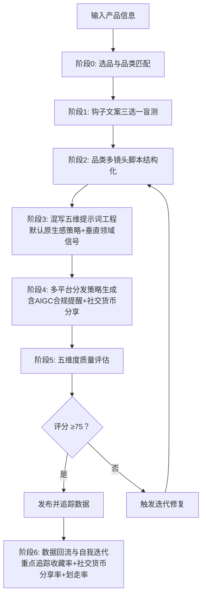

# TikTok 广告视频生成 Skill · Seedance 2.0 专用版

> **核心目标**：以最小成本、最高概率生成 TikTok/Reels/Shorts 全域爆款广告视频。

[](https://github.com/qq547820639/tiktok-ad-video-skill)
[](https://jimeng.jianying.com)
[](LICENSE.txt)


## 📖 用户使用指南

### 第一步：了解如何加载 Skill

本 Skill 由一个核心工作流文件（`SKILL.md`）和多个知识库文件（`references/` 目录）组成。**为了获得最佳效果，建议同时加载核心文件和知识库文件。**

#### 🚀 推荐加载方式

| 加载方式 | 需要提供的文件 | 效果 | 适用场景 |
| :--- | :--- | :--- | :--- |
| **完整加载（推荐）** | `SKILL.md` + `references/` 目录下全部文件 | AI 能自主查阅知识库，输出专业、精准、可复现 | 正式生产环境、长期高频使用 |
| **精简加载** | 仅 `SKILL.md` | AI 可运行基本流程，但输出依赖自身知识，质量不够稳定 | 快速测试、临时使用 |
| **按需加载** | 首次仅 `SKILL.md`，遇到具体问题时再提供对应 reference 文件 | 灵活省 token，但需要用户判断何时补充资料 | 有一定经验的用户 |

#### 📚 各文件作用一览

| 文件 | 作用 | 是否必需 |
| :--- | :--- | :--- |
| `SKILL.md` | **核心工作流**：角色定义、6 阶段流程、铁律与自迭代逻辑 | ✅ 必需 |
| `references/viral-hook-patterns.md` | 6 大钩子库 + 品类多镜头模板 + 社交货币分享话术 | 强烈推荐 |
| `references/cinematic-vocabulary.md` | 五维架构词汇表 + 混写指南 + 原生感默认词汇包 + Fast模式技巧 | 强烈推荐 |
| `references/evaluation-rubric.md` | 五维度评分标准 + 失败模式速查表 | 强烈推荐 |
| `references/platform-specs.md` | 2026 各平台算法规则、小批量测试分发、TikTok SEO、划走率、AIGC标签 | 推荐 |
| `references/failure-case-library.md` | 16 个典型失败案例与精准修复方案 | 推荐 |
| `references/ab-testing-matrix.md` | A/B 测试模板（含社交货币、原生感、垂直领域信号、Fast模式测试） | 按需 |
| `references/ad-campaign-testing.md` | 广告创意测试指南（含测试池突破专项测试、AIGC合规影响） | 按需 |
| `references/localization-guide.md` | 出海本土化指南（含ACE方法论落地、多模态素材本土化、AIGC标签地区差异） | 按需 |

#### 💡 如何加载到 AI 助手

**如果你使用的是 ChatGPT / Claude / DeepSeek 等通用 AI**：
1. 打开对话窗口。
2. 将推荐加载的文件内容**全部复制**，粘贴到输入框。
3. 在内容前加上一句提示语：
   > *"请仔细阅读以下 Skill 文档和知识库，并严格按照其中的方法论、工作流和评分标准来执行任务。在收到我的产品信息后，请按照工作流为我生成广告视频。"*

**如果你使用的是 Dify / Coze / GPTs 等支持知识库的平台**：
1. 将 `SKILL.md` 设置为系统提示词（System Prompt）。
2. 将 `references/` 目录整体上传为知识库，AI 会在运行时自动检索相关文档。


### 第二步：输入产品信息

向加载了 Skill 的 AI 助手发送你的产品信息。**最简单的输入方式**：

> “我卖 [产品名称]，核心卖点是 [一句话描述]，价格在 [价格区间]，目标客户是 [人群描述]。”

**示例**：
> “我卖罗莎琳德美甲灯，15颗灯珠秒干不黑手，价格 $8.85，目标客户是 18-35 岁 DIY 美甲爱好者。”

### 第三步：参与钩子盲选

Skill 会输出 **3 个爆款钩子文案选项**（例如 A/B/C），请你凭直觉选择最能吸引你的一个。

### 第四步：获取生成资源

Skill 会根据你的选择和产品品类，匹配最佳的多镜头叙事模板（3-4 个镜头），并输出：

1. **15 秒多镜头脚本**（含过程微距、复播彩蛋、收藏引导、社交货币分享、垂直领域信号）
2. **Seedance 2.0 完整提示词**（提供纯英文版和**混写版**——推荐使用混写版，中文意境 + 英文精准指令，效果最佳）
3. **多平台发布指南**（包含各平台标题、标签、收藏/社交货币分享话术、TikTok SEO 策略、AIGC标签提醒）

### 第五步：生成视频

1. 打开即梦 AI 的 **文生视频** 功能。
2. 将 Skill 输出的 **混写版提示词**（推荐）或纯英文提示词粘贴到输入框。
3. 选择 **Seedance 2.0 模型**，时长选择 **15 秒**，比例选择 **9:16**。
4. **测试阶段建议选择 Fast 模式**（成本降低 30%-50%，约 60-84 积分/次），确认方向后可用标准模式生成最终素材。
5. 点击生成，下载生成的视频。

### 第六步：反馈数据，让 Skill 自我迭代

视频发布 3-7 天后，**回到对话中告诉 Skill 视频的表现**。Skill 会主动询问关键数据（播放量、完播率、**收藏率**、**分享率**、**划走率**），并**自动分析、自动调整后续视频的生成策略**。


### 🚨 常见问题速查

| 问题 | 解决方法 |
| :--- | :--- |
| **生成的视频有人物手部畸变** | 在提示词中加入 `手部完好无多余手指 (Well-formed hands, No extra fingers)` |
| **视频前 3 秒不够抓人** | 关注度持续时间下降 69%，必须在提示词最前面加上 `High CTR style, Eye-catching opening` |
| **画面单调、像看PPT** | 使用品类对应的多镜头模板（3-4 镜头），加入过程微距镜头 |
| **运镜质感差、无电影感** | 使用混写版运镜指令：`缓慢推近 (Slow dolly-in)` / `轻微环绕 (Slight orbit)` |
| **收藏率低** | 增加收藏引导话术：`Save for your next ___` + 收藏图标动画 |
| **分享率低** | 使用社交货币分享话术：展现品味型 `Share this if you have good taste` / 圈层归属型 `Tag your ___ bestie` |
| **新视频播放量卡在 200-500** | TikTok 小批量测试池突破失败，强化前 3 秒冲击力，前5秒口述+字幕双重强化核心主题词，增加收藏/社交货币分享引导 |
| **流量不精准，评论“为什么给我推这个”** | 前5秒口述+字幕双重强化核心主题词（如“nail lamp”“cleaning hack”），帮助算法精准识别垂直领域 |
| **TikTok 搜索流量少** | 标题和字幕加入核心关键词，评论区置顶重复关键词 |
| **Instagram 推荐少** | 保持每日1-3条发布频率，分散到不同日期发布，获取“当日发布优先”推荐 |
| **YouTube Shorts 划走率高** | 前 2 秒必须制造极端特写+快速切换，添加 `Snappy motion, no slow pans` |
| **AI 味太重，像广告** | 启用原生感策略：`真实素人反应 (Authentic unscripted reaction)` / `自然窗光 (Natural window light)` / `生活化杂乱背景 (Lived-in messy background)` |
| **Fast 模式画质下降** | 降低帧率至 30fps，简化运镜组合，使用精简版提示词 |
| **视频发布后被限流** | 检查是否勾选平台 AIGC 标签：TikTok（AI-generated）、Meta（Made with AI）、YouTube（Altered content） |
| **想投放付费广告** | 参考 `references/ad-campaign-testing.md` |
| **想在多个国家投放** | 参考 `references/localization-guide.md` |


## 🎯 一句话简介

这是一个为 **即梦 AI Seedance 2.0** 量身打造的、具备**自我迭代能力**的 TikTok 广告视频生成 Skill。通过“钩子预判 → 图文盲测 → 品类多镜头脚本 → 混写五维提示词 → 多平台分发 → 五维评估 → 数据归因”闭环，帮助你在 2026 年的短视频算法环境下，用最少的积分消耗，跑出最高的爆款概率。


## ✨ v2.7 核心更新 (2026.05)

| 更新项 | 说明 |
| :--- | :--- |
| 📌 **快速诊断决策树** | SKILL.md 开头新增决策树，用户可根据问题直接跳转到对应章节 |
| 🎯 **TikTok 垂直领域强化信号** | 新增核心铁律：前5秒口述+字幕双重强化核心主题词，帮助算法精准识别内容领域 |
| ⚖️ **AIGC 合规强制提醒** | 阶段4新增独立合规区块，发布时强制提醒勾选各平台 AI 标签 |
| 📅 **Meta Reels 当日发布优先深度策略** | 建议每日1-3条分散发布，最大化获取 50%+ 额外分发权重 |
| 🔗 **YouTube Shorts 多平台分享加权** | 新增引导观众跨平台分享策略，获取额外算法加权 |
| 📋 **平台特性快速对照卡** | platform-specs.md 新增一句话总结对照卡，快速查阅各平台核心信号 |
| 🧪 **垂直领域信号 A/B 测试模块** | ab-testing-matrix.md 新增信号对比测试模板 |
| 🚨 **失败案例扩充至 16 个** | 新增垂直领域信号缺失、AIGC标签未勾选限流、YouTube划走率过高 3 个高频案例 |
| 🏪 **TikTok Shop ACE 方法论落地指南** | localization-guide.md 新增三场域联动本土化操作指南 |
| 🌐 **AIGC 标签地区差异说明** | localization-guide.md 新增各市场 AIGC 合规要求对照表 |


## 📁 仓库结构

```
tiktok-ad-video-skill/
├── SKILL.md                         # 🧠 核心工作流（必需）
├── README.md                        # 📖 项目说明（本文件）
├── CHANGELOG.md                     # 📋 版本变更日志
├── LICENSE.txt                      # 📄 MIT 开源协议
├── examples/
│   └── prompt-examples.md           # 📝 6 个混写+纯英文提示词示例
└── references/
    ├── viral-hook-patterns.md       # 🔥 钩子库 + 品类多镜头模板 + 社交货币分享
    ├── cinematic-vocabulary.md      # 🎬 五维架构词汇 + 混写指南 + Fast模式技巧
    ├── platform-specs.md            # 📱 2026 平台算法 + 小批量测试 + AIGC标签
    ├── evaluation-rubric.md         # 📊 五维度评分表（v2.7）
    ├── product-tracker-template.md  # 📈 产品追踪模板（v2.7）
    ├── failure-case-library.md      # 🚨 16 个失败案例与修复方案
    ├── ab-testing-matrix.md         # 🧪 A/B 测试矩阵模板
    ├── ad-campaign-testing.md       # 📊 广告创意测试指南
    └── localization-guide.md        # 🌍 出海本土化指南
```


## 🧠 核心工作流（6 个阶段）




## 🔥 六大爆款钩子类型

| 钩子类型 | 核心心理触发点 | 适用产品 | 推荐镜头模板 | 爆款指数 |
| :--- | :--- | :--- | :--- | :--- |
| **认知失调型** | 违背常识、打破预期 | 清洁神器、黑科技 | 功能效果型 (4镜头) | ⭐⭐⭐⭐⭐ |
| **极简结果型** | 懒惰红利、一步到位 | 收纳、厨房工具 | 极简结果型 (3镜头) | ⭐⭐⭐⭐⭐ |
| **价格锚点型** | 占便宜心理、价值错位 | 百货、服饰 | 高性价比型 (4镜头) | ⭐⭐⭐⭐ |
| **情感绑架型** | 愧疚感、爱与被爱 | 礼品、护理 | 情感共鸣型 (4镜头) | ⭐⭐⭐⭐ |
| **视觉奇观型** | 解压、ASMR | 食品、切割工具 | 功能效果型 (4镜头) | ⭐⭐⭐⭐ |
| **身份认同型** | 圈层归属、社交标签 | 垂直品类 | 极简结果型 (3镜头) | ⭐⭐⭐ |


## 📊 五维度质量评估体系 (v2.7)

| 维度 | 分值 | 核心指标 |
| :--- | :--- | :--- |
| **技术质量** | 20 分 | 画面清晰度 + 运镜质感 + AI瑕疵控制 |
| **爆款钩子** | 30 分 | 前3秒留存 + 完播潜力 + 复播引导 |
| **平台适配** | 20 分 | 收藏引导力 + 社交货币分享引导力 + 垂直领域信号 + 各平台适配 |
| **导演执行** | 15 分 | 五维架构执行度 + 原生感执行度 + 垂直领域信号执行度 + 多镜头结构 + 音频同步 + 转场质量 |
| **算法信号** | 15 分 | 复播率预估 + 收藏率预估 + 分享率预估 |
| **总分** | **100 分** | ≥75 发布 / 60-74 优化 / <60 废弃 |


## 🔄 自我迭代机制

1. **每次任务** → 后台生成《自检报告》
2. **用户反馈数据** → 告诉 Skill 播放量、完播率、**收藏率**、**分享率**、**划走率**
3. **自动分析归因** → 判断品类-模板匹配度、五维架构执行效果、垂直领域信号有效性、社交货币分享有效性
4. **连续 3 次验证** → 触发模板权重调整或话术优化


## 📊 核心功能速览

| 功能项 | 详情 |
| :--- | :--- |
| 视频格式 | 9:16 竖屏，15 秒 |
| 脚本结构 | 品类匹配多镜头模板（3-4 镜头） |
| 提示词架构 | 五维架构（技术基底+镜头运动+视觉+光影+动态） |
| 提示词格式 | 混写版（中文意境 + 英文精准指令）/ 纯英文版 |
| 默认风格 | 原生感（UGC风格）——素人演员、生活化场景、自然光线 |
| 垂直领域信号 | 前5秒口述+字幕双重强化核心主题词 |
| 运镜控制 | 推拉摇移跟环绕等 7 种标准化指令 |
| 互动重点 | 收藏(Save) + 社交货币分享(Share) |
| 支持平台 | TikTok、Meta (FB/IG)、YouTube Shorts、Pinterest、Snapchat |
| 质量评分 | 五维度 100 分制 |
| 标准模式成本 | 120 积分/次（Seedance 2.0 标准模式） |
| Fast 模式成本 | 约 60-84 积分/次（测试阶段推荐） |
| AIGC 合规 | 发布时强制提醒勾选各平台 AI 标签 |


## 🏆 实战验证

本 Skill 经过 **80+ 条视频、8+ 个生产日** 的实战打磨：

- 清洁用品：完播率 48%，收藏率 12%，分享率 8%（功能效果型 4 镜头模板 + 垂直领域信号）
- 美甲灯：完播率 52%，收藏率 15%，分享率 10%（高性价比型 4 镜头模板 + 展现品味型社交货币）
- 收纳用品：完播率 45%，收藏率 18%（极简结果型 3 镜头模板 + 圈层归属型社交货币）
- 食品饮料：重播率 41%，分享率 12%（视觉奇观型 + ASMR 音频同步）


## 📋 使用要求

- 即梦 AI 账号（[jimeng.jianying.com](https://jimeng.jianying.com)）及充足积分
- 浏览器自动化能力（用于提交生成任务）
- 对电商选品的基本理解


## 📄 开源协议

MIT License © 2026 — 详见 `LICENSE.txt` 获取完整条款。


## 🤝 贡献与反馈

欢迎提交 Issue 或 Pull Request。


**记住**：不浪费积分，先测钩子再生成。品类匹配多镜头，混写提示出质感。原生感为核心，垂直信号定精准，社交货币拉分享，AIGC标签保合规。
