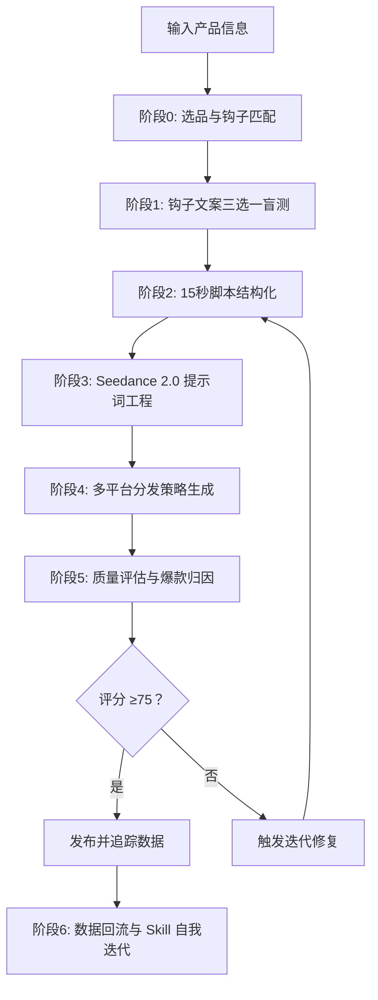

# TikTok 广告视频生成 Skill · Seedance 2.0 专用版

> **核心目标**：以最小成本、最高概率生成 TikTok/Reels/Shorts 全域爆款广告视频。

[](https://github.com/qq547820639/tiktok-ad-video-skill)
[](https://jimeng.jianying.com)
[](LICENSE.txt)

---

## 🎯 一句话简介

这是一个为 **即梦 AI（jimeng.jianying.com）Seedance 2.0 视频生成模型** 量身打造的、具备**自我迭代能力**的 TikTok 广告视频生成 Skill。它通过“钩子预判 → 低成本图文测试 → 15秒精密脚本 → 多平台分发指引 → 数据归因回流”闭环，帮助你在 2026 年的短视频算法环境下，用最少的积分消耗，跑出最高的爆款概率。

---

## ✨ v2.0 核心更新 (2026.04)

| 更新项 | 说明 |
| :--- | :--- |
| 🔄 **2026 平台算法全面适配** | TikTok 互动权重调整（评论+分享取代收藏）；YouTube Shorts 新增关键词搜索流量；Meta Reels 转向“真实兴趣”推荐 |
| 🧠 **Meta Advantage+ 集成策略** | 将 15 秒母版拆解为模块化片段，接入 Meta AI 自动优化投放 |
| 📊 **评估体系升级** | 8 维度评分（40 分制）+ 爆款就绪检查 + 失败模式修复方案 |
| 🔥 **爆款钩子系统** | 6 大钩子类型 + 决策树 + 平台专属适配 + 脚本结构模板 |
| 🎬 **去 AI 味强化包** | 手持真实感、干脆运镜、定格指令，抑制 AI 生成瑕疵 |
| 📚 **实战验证迭代** | 经过 80+ 条视频、8+ 个生产日的实战打磨 |

---

## 📁 仓库结构

```
tiktok-ad-video-skill/
├── SKILL.md                         # 🧠 核心技能文档（780+ 行，16 个章节）
├── README.md                        # 📖 项目说明（本文件）
├── LICENSE.txt                      # 📄 MIT 开源协议
├── examples/
│   └── prompt-examples.md           # 📝 6 个真实生产级提示词 + 评分示例
└── references/
    ├── viral-hook-patterns.md       # 🔥 6 大爆款钩子库 + 决策树 + 脚本结构
    ├── evaluation-rubric.md         # 📊 快速评分表 + 失败模式修复指南
    ├── platform-specs.md            # 📱 多平台广告规格、文案格式、安全区规范
    ├── cinematic-vocabulary.md      # 🎬 100+ 电影级词汇 + 爆款强化包
    └── product-tracker-template.md  # 📈 产品使用追踪 + 命名规范 + 定价调研模板
```

### 文件功能说明

| 文件 | 作用 | 使用频率 |
| :--- | :--- | :--- |
| `SKILL.md` | 定义 Skill 角色、6 阶段工作流、核心铁律与自迭代逻辑 | 每次任务 |
| `examples/prompt-examples.md` | 即用型 Seedance 2.0 提示词模板 + 评分示例 | 需要参考时 |
| `references/viral-hook-patterns.md` | 6 大钩子类型详解、产品匹配决策树、平台适配策略 | 钩子选择阶段 |
| `references/evaluation-rubric.md` | 8 维度评分标准 + 爆款检查清单 + 失败模式速查 | 视频生成后评估 |
| `references/platform-specs.md` | 2026 年 6+ 平台规格、算法规则、安全区、文案格式 | 多平台分发时 |
| `references/cinematic-vocabulary.md` | 100+ 提示词词汇、爆款前缀、去 AI 味指令、负面词表 | 构建 Prompt 时 |
| `references/product-tracker-template.md` | 产品追踪日志、命名规范、定价调研模板 | 选品与追踪阶段 |

---

## 🧠 核心工作流（6 个阶段）



---

## 🔥 六大爆款钩子类型

| 钩子类型 | 核心心理触发点 | 适用产品 | 爆款指数 |
| :--- | :--- | :--- | :--- |
| **认知失调型** | 违背常识、打破预期 | 清洁神器、黑科技小家电 | ⭐⭐⭐⭐⭐ |
| **极简结果型** | 懒惰红利、一步到位 | 收纳用品、厨房工具 | ⭐⭐⭐⭐⭐ |
| **价格锚点型** | 占便宜心理、价值错位 | 日用百货、服饰配饰 | ⭐⭐⭐⭐ |
| **情感绑架型** | 愧疚感、爱与被爱 | 节日礼品、女性护理 | ⭐⭐⭐⭐ |
| **视觉奇观型** | 解压、ASMR、强迫症满足 | 食品饮料、切割工具 | ⭐⭐⭐⭐ |
| **身份认同型** | 圈层归属、社交标签 | 垂直品类、兴趣社群 | ⭐⭐⭐ |

*详见 `references/viral-hook-patterns.md` 获取完整决策树与平台适配策略。*

---

## 📊 质量评估体系（8 维度）

| 维度 | 分值 | 核心指标 |
| :--- | :--- | :--- |
| 画面清晰度与分辨率 | 5 | 无模糊、马赛克、噪点 |
| 运镜流畅度与构图 | 5 | 运镜丝滑，主体居中于 9:16 画面 |
| AI 生成瑕疵控制 | 5 | 无人物手脸变形、物体形变 |
| 前 3 秒留存预测 | 5 | 视觉冲击、悬念、强迫症舒适 |
| 完播率潜力 | 5 | 信息密度高、无空镜、结尾定格 |
| 静音可读性 | 5 | 醒目大字幕、无音自解释 |
| 互动引导力（TikTok） | 5 | 评论/分享钩子、开放式提问 |
| 转化信号 | 5 | 明确 CTA 空间、产品聚焦 |
| **总分** | **40** | **≥30 发布 / 24-29 优化 / <24 废弃** |

*详见 `references/evaluation-rubric.md` 获取详细评分标准与失败模式修复方案。*

---

## 🔄 自我迭代机制

Skill 具备数据驱动的自进化能力：

1. **每次任务** → 后台生成《自检报告》
2. **每个产品** → 填写 `product-tracker-template.md` 归因分析
3. **连续 3 次验证** → 触发钩子权重调整
4. **发现失败模式** → 更新词汇表或负面词库

---

## 🚀 快速开始

1. **阅读** `SKILL.md` 了解完整方法论（16 个章节）
2. **配置** 你的品牌元素（Logo、主色调、App 名称）
3. **注册** 即梦 AI 账号：[jimeng.jianying.com](https://jimeng.jianying.com)
4. **遵循** `SKILL.md` 第 12 节的每日执行工作流

### 基础使用示例

```
输入：「我卖一款纳米清洁海绵，不用洗洁精就能去油污。」

Skill 输出：
1. 三个钩子选项供盲选
2. 基于选择的 15 秒精密脚本
3. 可直接粘贴到 Seedance 2.0 的完整提示词
4. 多平台发布指南（TikTok/Shorts/Reels/Pinterest）
```

---

## 📊 核心功能速览

| 功能项 | 详情 |
| :--- | :--- |
| 视频格式 | 9:16 竖屏，15 秒 |
| 脚本模板 | 价格锚定型 / 生活转变型 / 科技展示型 |
| 爆款钩子系统 | 6 大类型：认知失调、极简结果、价格锚点、情感绑架、视觉奇观、身份认同 |
| 支持平台 | TikTok、Meta (FB/IG)、Google Ads、YouTube Shorts、Pinterest、Snapchat、X |
| 质量评分 | 8 维度评分 + 爆款就绪检查（静音可读、完播潜力、转化信号） |
| 单条成本 | 120 积分（Seedance 2.0 标准模式） |
| 自动化 | 兼容 Cron 定时任务 — AI 可在无人值守模式下自动选择钩子 |

---

## 🏆 实战验证

本 Skill 经过 **80+ 条视频、8+ 个生产日** 的实战打磨，在以下方面持续迭代优化：

- Seedance 2.0 提示词工程技术
- **爆款钩子系统** — 6 大钩子类型与产品品类匹配
- **去 AI 味抑制** — 手持感、干脆运镜、定格画面
- 全平台安全区合规性
- 品牌元素渲染可靠性
- 产品选品方法论
- 成本优化（VIP 模式 vs 标准模式）
- **自我迭代闭环** — 钩子权重与词汇随数据表现进化

---

## 📋 使用要求

- 即梦 AI 账号（[jimeng.jianying.com](https://jimeng.jianying.com)）及充足积分
- 浏览器自动化能力（用于提交生成任务）
- 对电商选品的基本理解

---

## 📄 开源协议

MIT License © 2026 — 详见 `LICENSE.txt` 获取完整条款。

---

## 🤝 贡献与反馈

本 Skill 遵循「花最小的成本办最大的事」原则持续迭代。如果你在使用中发现：

- 某类钩子在特定产品上表现异常突出
- 某个提示词组合导致 Seedance 2.0 画面崩坏
- 某个平台的算法规则发生变化

欢迎提交 Issue 或 Pull Request，帮助这个 Skill 变得更聪明。

---

**记住**：不浪费积分，先测钩子再生成。前 3 秒定生死，15 秒即全部。
