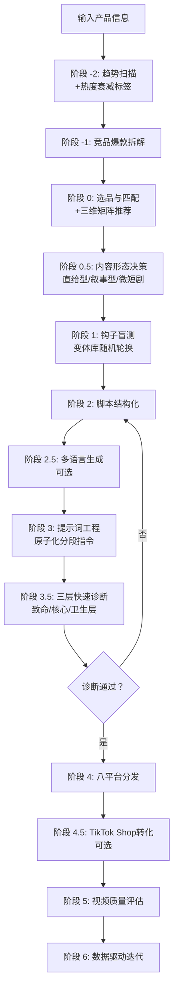

## 文档 1/6：`README.md` v2.15

# TikTok 广告视频生成 Skill · Seedance 2.0 专用版

> **核心目标**：以最小成本、最高概率生成 TikTok/Reels/Shorts/Threads/Lemon8 全域爆款广告视频。

[](https://github.com/qq547820639/tiktok-ad-video-skill)
[](https://jimeng.jianying.com)
[](LICENSE.txt)


## ⚡ 30秒极简加载指南（着急的直接看这里）

**DeepSeek 用户**：
1. 复制 `SKILL.md` 全部内容
2. 粘贴到 DeepSeek 的 System Prompt 设置区域
3. 在对话中输入你的产品信息，开始生成视频

**其他 AI（ChatGPT / Claude 等）用户**：
1. 复制 `SKILL-lite.md` 全部内容（Token 消耗减少约 60%）
2. 粘贴到对话中，第一行加上：**“请严格按以下 Skill 工作流执行任务：”**
3. 发送后，输入你的产品信息，开始生成视频

就这么简单。详细说明见下方「第一步」。


## 📖 用户使用指南

### 第一步：了解如何加载 Skill

本 Skill 由一个核心工作流文件（`SKILL.md`）和多个知识库文件（`references/` 目录）组成。**v2.15 已针对 DeepSeek 的 System Prompt 机制深度适配。**

#### 🚀 推荐加载方式（按 AI 平台）

| AI 平台 | 推荐文件 | 加载方式 | 效果 |
| :--- | :--- | :--- | :--- |
| **DeepSeek** | `SKILL.md` | System Prompt 设置区域 | 最优适配，Token 消耗约 15-20% 上下文窗口 |
| **ChatGPT / Claude** | `SKILL-lite.md` | 对话中粘贴 | Token 友好，覆盖 80% 场景 |
| **Dify / Coze / GPTs** | `SKILL.md` + `references/` 上传为知识库 | System Prompt + 知识库 | AI 自动检索，功能最全 |

#### 📚 各文件作用一览

| 文件 | 作用 | 是否必需 |
| :--- | :--- | :--- |
| `SKILL.md` | **核心路由器（v2.15）**：核心铁律、工作流索引、三层诊断、输出规范 | ✅ 必需 |
| `SKILL-lite.md` | **精简版**：Token 友好，仅含核心工作流+评分表+钩子库 | 推荐 |
| `references/viral-hook-patterns.md` | 7 大钩子库 + 三维匹配矩阵（品类×钩子×趋势）+ 40+ 变体库 | 强烈推荐 |
| `references/narrative-ad-playbook.md` | 叙事型软广剧本指南（5种模板+评论区运营） | 美国市场推荐 |
| `references/short-drama-series-guide.md` | **v2.15 新增**：微短剧系列化脚本模板（含转化点植入） | 系列化内容推荐 |
| `references/cinematic-vocabulary.md` | **v2.15 更新**：Seedance 2.0 官方标准词汇表（6步公式+最佳长度+运镜词库） | 强烈推荐 |
| `references/evaluation-rubric.md` | **v2.15 更新**：五维度评分表 + Prompt三层诊断标准 | 强烈推荐 |
| `references/localization-script-guide.md` | 多语言本土化指南（7种语言） | 出海市场推荐 |
| `references/platform-specs.md` | 8 平台算法规则（含 Threads/Lemon8）+ 最佳发布时间 | 推荐 |
| `references/calibration-guide.md` | 评分权重校准指南（含手动方法和 Python 脚本） | 进阶用户 |
| `references/case-studies.md` | 按品类组织的实战案例库（成功+失败+可复用公式） | 推荐 |
| `references/failure-case-library.md` | 16 个典型失败案例与精准修复方案 | 按需 |
| `references/ab-testing-matrix.md` | A/B 测试模板 | 按需 |
| `references/ad-campaign-testing.md` | 广告创意测试指南 | 按需 |


### 第二步：输入产品信息

向加载了 Skill 的 AI 助手发送你的产品信息。**最简单的输入方式**：

> “我卖 [产品名称]，核心卖点是 [一句话描述]，价格在 [价格区间]，目标客户是 [人群描述]。”

**示例**：
> “我卖罗莎琳德美甲灯，15颗灯珠秒干不黑手，价格 $8.85，目标客户是 18-35 岁 DIY 美甲爱好者。”

### 第三步：参与钩子盲选

Skill 会输出 **3 个爆款钩子文案选项**（例如 A/B/C），请你凭直觉选择最能吸引你的一个。

### 第四步：获取生成资源

Skill 会根据你的选择和产品品类，匹配最佳的多镜头叙事模板（3-4 个镜头），并输出：

1. **15 秒多镜头脚本**（含声音钩子、过程微距、复播彩蛋、收藏引导、社交货币分享）
2. **Seedance 2.0 原子化分段提示词**（v2.15 新格式：每段 30-60 词，单镜头单一运镜）
3. **多平台发布指南**（TikTok/Shorts/Reels/Threads/Lemon8/Pinterest/Snapchat/FB）

### 第五步：Prompt 三层快速诊断（积分风控 · 必做）

在将提示词提交给即梦 AI **之前**，Skill 会自动进行 **三层快速诊断**：

- **🔴 致命层**：钩子是否有视觉冲突？是否有声音钩子？ → 任一不通过，禁止提交
- **🟡 核心层**：垂直信号是否前 5 秒口述+字幕双出现？原生感是否启用？ → 任一不通过，警告后微调
- **🟢 卫生层**：是否含否定式负向词？是否超过 100 词/段？ → 任一不通过，自动修正

### 第六步：生成视频

1. 诊断通过后，打开即梦 AI 的 **文生视频** 功能。
2. 将 Skill 输出的 **分段提示词** 逐段粘贴，分别生成每个镜头。
3. 选择 **Seedance 2.0 模型**，时长选择 **15 秒**，比例选择 **9:16**。
4. **冷启动测试阶段建议选择 Fast 模式**（约 60-84 积分/次）。
5. 在剪映中拼接各段，添加后期音效和字幕。

### 第七步：多平台分发与数据迭代

1. **分发**：按照生成的《多平台发布指南》，将视频发布到 TikTok、Reels、Shorts、Threads、Lemon8 等平台。
2. **数据反馈**：发布 7 天后，回到对话中告诉 Skill 视频表现（播放量、完播率、收藏率、分享率），Skill 会**自动分析并调整后续策略**。
3. **校准优化**：累计 20+ 条视频数据后，可使用 `calibration-guide.md` 校准评分权重。


### 🚨 常见问题速查

| 问题 | 解决方法 |
| :--- | :--- |
| **Prompt 诊断不通过（致命层）** | 退回阶段 2，强化钩子和声音策略，无需消耗积分 |
| **前 3 秒不够抓人** | 启用声音钩子：前3秒纯 ASMR/音效，口播第3秒进入 |
| **钩子选错导致数据差** | 对照 `viral-hook-patterns.md` 三维矩阵更换钩子 |
| **新视频播放量卡在 200-500** | 强化前3秒声音钩子，确认趋势热度阶段，增加收藏/分享引导 |
| **完播率低，中间划走** | 检查多镜头结构，增加 `Snappy motion, Quick cuts` |
| **收藏率低** | 增加收藏引导话术 |
| **分享率低** | 对照品类更换社交货币类型 |
| **AI 味太重** | 启用原生感策略 |
| **视频被限流** | 检查是否勾选平台 AIGC 标签 |
| **指令超长导致画面异常** | 原因：提示词超过 200 词。请改成分段生成 |
| **想生成英文/其他语言视频** | 使用阶段 2.5 多语言生成（覆盖7种语言） |
| **美国市场播放量卡在 300** | 切换到叙事型软广 |


## 🎯 一句话简介

这是一个为 **即梦 AI Seedance 2.0** 量身打造的、具备**自我迭代能力**的 TikTok 广告视频生成 Skill。通过“趋势扫描 → 竞品拆解 → 钩子盲测 → 品类多镜头脚本 → 原子化分段提示词 → 三层快速诊断 → 八平台分发 → 数据驱动迭代”闭环，在 2026 年的短视频算法环境下，用最少的积分消耗，跑出最高的爆款概率。


## ✨ v2.15 核心更新 (2026.05)

| 更新项 | 说明 |
| :--- | :--- |
| 🧠 **DeepSeek System Prompt 深度适配** | `SKILL.md` 从 800+ 行“百科全书”精简为约 150 行“路由器”，Token 消耗降低约 85% |
| 🎬 **微短剧系列化模板** | 新增 `short-drama-series-guide.md`，支持多集剧情设计和转化点植入 |
| ✂️ **Seedance 2.0 官方标准对齐** | 提示词升级为“原子化分段指令”（每段 30-60 词，≤100 词）；适配官方“6 步公式”与“60-100 词最佳区间” |
| 🔍 **预评估简化为三层快速诊断** | 从“五维精细打分”升级为“致命层/核心层/卫生层”三层诊断，更适配 System Prompt 环境 |
| 📝 **输出格式全面规范化** | 新增 §6 输出规范：正向锚点词替代否定式负向词，单镜头单一运镜，自动版本号 |
| 🕒 **最佳发布时间建议** | `platform-specs.md` 新增各平台最佳发布时间窗口 |
| 🔗 **SEO 策略全面升级** | 新增“短视频SEO”专门章节，含关键词权重排序和搜索优化技巧 |


## 📁 仓库结构（v2.15）

```
tiktok-ad-video-skill/
├── SKILL.md                         # 🧠 核心路由器（v2.15 · DeepSeek 深度适配）
├── SKILL-lite.md                    # ⚡ 精简版（Token友好）
├── README.md                        # 📖 项目说明（本文件）
├── CHANGELOG.md                     # 📋 版本变更日志
├── LICENSE.txt                      # 📄 MIT 开源协议
├── evaluation-rubric.md             # 📊 五维度评分表 + Prompt三层诊断
├── product-tracker-template.md      # 📈 产品追踪模板
├── examples/
│   └── prompt-examples.md           # 📝 提示词示例
└── references/
    ├── viral-hook-patterns.md       # 🔥 钩子库+三维矩阵+变体库
    ├── narrative-ad-playbook.md     # 🎬 叙事型软广剧本指南
    ├── short-drama-series-guide.md  # 🎭 微短剧系列化模板（v2.15新增）
    ├── cinematic-vocabulary.md      # 🎬 Seedance 2.0 官方词汇表（v2.15更新）
    ├── platform-specs.md            # 📱 8 平台算法+最佳发布时间（v2.15更新）
    ├── evaluation-rubric.md         # 📊 评估体系
    ├── localization-script-guide.md # 🌍 多语言本土化指南
    ├── calibration-guide.md         # 📈 评分校准指南
    ├── competitor-analysis-template.md # 🔍 竞品拆解模板
    ├── content-calendar-template.md # 📅 内容日历模板
    ├── data-driven-iteration.md     # 📈 数据驱动迭代指南
    ├── self-check-checklist.md      # ✅ 发布前自查清单
    ├── case-studies.md              # 📚 实战案例库
    ├── failure-case-library.md      # 🚨 失败案例库
    ├── ab-testing-matrix.md         # 🧪 A/B测试矩阵
    ├── ad-campaign-testing.md       # 📊 广告创意测试
    └── localization-guide.md        # 🌍 出海本土化指南
```


## 🧠 核心工作流（v2.15 路由器版）




## 🔥 三维匹配矩阵速查（部分示例）

| 品类 | ✅ 推荐钩子 | 声音策略 | 趋势适配建议 |
| :--- | :--- | :--- | :--- |
| 锅具/厨房 | 视觉奇观/故事型 | 纯 ASMR 前 3 秒 | #cookinghack + 治愈系烹饪音频 |
| 香水/美妆 | 场景共鸣 POV | 环境音，口播第 3 秒 | #selfcare + 季节性主题 |
| 清洁用品 | 认知失调型 | ASMR 擦拭声 | #cleaninghack + 强迫症舒适音频 |
| 收纳用品 | 极简结果型 | 轻快节奏音 | #homeorganization + 收纳改造话题 |


## 📊 Prompt 三层快速诊断

| 层级 | 检查项 | 不通过动作 |
| :--- | :--- | :--- |
| 🔴 **致命层** | 钩子是否有视觉冲突？是否有声音钩子？ | **禁止提交**，退回阶段 2 |
| 🟡 **核心层** | 垂直信号是否前 5 秒口述+字幕双出现？原生感是否启用？ | **警告 + 微调** |
| 🟢 **卫生层** | 是否含否定式负向词？是否超过 100 词/段？ | **自动修正** |


## 📊 核心功能速览

| 功能项 | 详情 |
| :--- | :--- |
| 视频格式 | 9:16 竖屏，15 秒（叙事型 45-60 秒） |
| 脚本结构 | 品类匹配多镜头模板（3-4 镜头） |
| 声音钩子 | 前 3 秒 ASMR/音效优先，口播第 3 秒进入 |
| 趋势感知 | 阶段 -2 实时扫描 + 四档热度衰减标签 |
| 多语言 | 7 种语言全覆盖 |
| 支持平台 | TikTok、YouTube Shorts、IG Reels、FB Reels、Threads、Lemon8、Pinterest、Snapchat |
| 预评估风控 | 三层快速诊断，致命层不通过禁止提交 |
| 提示词格式 | 原子化分段指令（每段 30-60 词） |
| 标准模式成本 | 120 积分/次 |
| Fast 模式成本 | 约 60-84 积分/次 |


## 📄 开源协议

MIT License © 2026 — 详见 `LICENSE.txt` 获取完整条款。


**记住**：前 3 秒声音钩子比画面更重要；趋势踩对事半功倍；原子化分段指令，每段不超过 100 词；致命层不通过绝不消耗积分。
