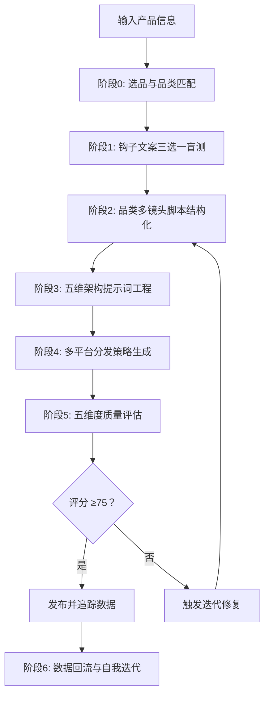

# TikTok 广告视频生成 Skill · Seedance 2.0 专用版

> **核心目标**：以最小成本、最高概率生成 TikTok/Reels/Shorts 全域爆款广告视频。

[](https://github.com/qq547820639/tiktok-ad-video-skill)
[](https://jimeng.jianying.com)
[](LICENSE.txt)

---

## 📖 用户使用指南

### 第一步：了解如何加载 Skill

本 Skill 由一个核心工作流文件（`SKILL.md`）和多个知识库文件（`references/` 目录）组成。**为了获得最佳效果，建议同时加载核心文件和知识库文件。**

#### 🚀 推荐加载方式

| 加载方式 | 需要提供的文件 | 效果 | 适用场景 |
| :--- | :--- | :--- | :--- |
| **完整加载（推荐）** | `SKILL.md` + `references/` 目录下全部文件 | AI 能自主查阅知识库，输出专业、精准、可复现 | 正式生产环境、长期高频使用 |
| **精简加载** | 仅 `SKILL.md` | AI 可运行基本流程，但输出依赖自身知识，质量不够稳定 | 快速测试、临时使用 |
| **按需加载** | 首次仅 `SKILL.md`，遇到具体问题时再提供对应 reference 文件 | 灵活省 token，但需要用户判断何时补充资料 | 有一定经验的用户 |

#### 📚 各文件作用一览

| 文件 | 作用 | 是否必需 |
| :--- | :--- | :--- |
| `SKILL.md` | **核心工作流**：角色定义、6 阶段流程、铁律与自迭代逻辑 | ✅ 必需 |
| `references/viral-hook-patterns.md` | 6 大钩子库 + 品类多镜头模板 + 收藏/分享引导话术 | 强烈推荐 |
| `references/cinematic-vocabulary.md` | 五维架构词汇表 + 标准化运镜词库 + 原生感词汇 | 强烈推荐 |
| `references/evaluation-rubric.md` | 五维度评分标准 + 失败模式速查表 | 强烈推荐 |
| `references/platform-specs.md` | 2026 各平台算法规则、收藏/分享权重、技术规格 | 推荐 |
| `references/failure-case-library.md` | 10 个典型失败案例与精准修复方案 | 推荐 |
| `references/ab-testing-matrix.md` | A/B 测试模板 | 按需 |
| `references/ad-campaign-testing.md` | 广告创意测试指南 | 按需 |
| `references/localization-guide.md` | 出海本土化指南 | 按需 |

#### 💡 如何加载到 AI 助手

**如果你使用的是 ChatGPT / Claude / DeepSeek 等通用 AI**：
1. 打开对话窗口。
2. 将推荐加载的文件内容**全部复制**，粘贴到输入框。
3. 在内容前加上一句提示语：
   > *"请仔细阅读以下 Skill 文档和知识库，并严格按照其中的方法论、工作流和评分标准来执行任务。在收到我的产品信息后，请按照工作流为我生成广告视频。"*

**如果你使用的是 Dify / Coze / GPTs 等支持知识库的平台**：
1. 将 `SKILL.md` 设置为系统提示词（System Prompt）。
2. 将 `references/` 目录整体上传为知识库，AI 会在运行时自动检索相关文档。

---

### 第二步：输入产品信息

向加载了 Skill 的 AI 助手发送你的产品信息。**最简单的输入方式**：

> “我卖 [产品名称]，核心卖点是 [一句话描述]，价格在 [价格区间]，目标客户是 [人群描述]。”

**示例**：
> “我卖罗莎琳德美甲灯，15颗灯珠秒干不黑手，价格 $8.85，目标客户是 18-35 岁 DIY 美甲爱好者。”

### 第三步：参与钩子盲选

Skill 会输出 **3 个爆款钩子文案选项**（例如 A/B/C），请你凭直觉选择最能吸引你的一个。

### 第四步：获取生成资源

Skill 会根据你的选择和产品品类，匹配最佳的多镜头叙事模板（3-4 个镜头），并输出：

1. **15 秒多镜头脚本**（含过程微距、复播彩蛋、收藏/分享引导）
2. **Seedance 2.0 完整提示词**（采用五维架构：技术基底+镜头运动+视觉元素+光影系统+动态设计）
3. **多平台发布指南**（包含各平台标题、标签、收藏/分享引导话术）

### 第五步：生成视频

1. 打开即梦 AI 的 **文生视频** 功能。
2. 将 Skill 输出的 **英文提示词** 粘贴到输入框。
3. 选择 **Seedance 2.0 模型**，时长选择 **15 秒**，比例选择 **9:16**。
4. 点击生成，下载生成的视频。

### 第六步：反馈数据，让 Skill 自我迭代

视频发布 3-7 天后，**回到对话中告诉 Skill 视频的表现**。Skill 会主动询问关键数据（播放量、完播率、**收藏率**、**分享率**），并**自动分析、自动调整后续视频的生成策略**。

---

## 🎯 一句话简介

这是一个为 **即梦 AI Seedance 2.0** 量身打造的、具备**自我迭代能力**的 TikTok 广告视频生成 Skill。通过“钩子预判 → 图文盲测 → 品类多镜头脚本 → 五维提示词工程 → 多平台分发 → 五维评估 → 数据归因”闭环，帮助你在 2026 年的短视频算法环境下，用最少的积分消耗，跑出最高的爆款概率。

---

## ✨ v2.4 / v2.3 核心更新 (2026.04)

| 更新项 | 说明 |
| :--- | :--- |
| 🎬 **品类场景化多镜头模板** | 告别一刀切“双镜头”，按功能效果/高性价比/情感共鸣/极简结果匹配 3-4 镜头叙事模板 |
| 🎥 **五维提示词架构** | 提示词升级为结构化导演指令：技术基底 + 镜头运动 + 视觉元素 + 光影系统 + 动态设计 |
| 🎛️ **标准化运镜词库** | 推拉摇移跟环绕等 7 种基础运镜 + 进阶组合，精准控制镜头语言 |
| 🔖 **收藏/分享最高权重** | 互动策略全面转向 2026 最强信号：收藏(Save) = 分享(Share) > 评论 > 点赞 |
| 📊 **五维评估体系升级** | 新增“导演执行”维度，评估五维架构执行度与运镜质感 |
| 🌍 **平台算法深度刷新** | 纳入 TikTok 粉丝优先测试、收藏/分享权重、Meta UTIS 模型、YouTube Shorts 搜索过滤器 |
| 🤳 **原生感词汇包** | 素人演员、生活化场景、手持自拍感等词汇，对齐 2026 真实化内容趋势 |

---

## 📁 仓库结构

```
tiktok-ad-video-skill/
├── SKILL.md                         # 🧠 核心工作流（必需）
├── README.md                        # 📖 项目说明（本文件）
├── CHANGELOG.md                     # 📋 版本变更日志
├── LICENSE.txt                      # 📄 MIT 开源协议
├── evaluation-rubric.md             # 📊 五维度评分表
├── product-tracker-template.md      # 📈 产品追踪模板（可选）
├── examples/
│   └── prompt-examples.md           # 📝 6 个五维架构+多镜头提示词示例
└── references/
    ├── viral-hook-patterns.md       # 🔥 钩子库 + 品类多镜头模板
    ├── cinematic-vocabulary.md      # 🎬 五维架构词汇 + 运镜词库
    ├── platform-specs.md            # 📱 2026 平台算法规格
    ├── failure-case-library.md      # 🚨 失败案例与修复方案
    ├── ab-testing-matrix.md         # 🧪 A/B 测试矩阵模板
    ├── ad-campaign-testing.md       # 📊 广告创意测试指南
    └── localization-guide.md        # 🌍 出海本土化指南
```

---

## 🧠 核心工作流（6 个阶段）



---

## 🔥 六大爆款钩子类型

| 钩子类型 | 核心心理触发点 | 适用产品 | 推荐镜头模板 |
| :--- | :--- | :--- | :--- |
| **认知失调型** | 违背常识、打破预期 | 清洁神器、黑科技 | 功能效果型 (4镜头) |
| **极简结果型** | 懒惰红利、一步到位 | 收纳、厨房工具 | 极简结果型 (3镜头) |
| **价格锚点型** | 占便宜心理、价值错位 | 百货、服饰 | 高性价比型 (4镜头) |
| **情感绑架型** | 愧疚感、爱与被爱 | 礼品、护理 | 情感共鸣型 (4镜头) |
| **视觉奇观型** | 解压、ASMR | 食品、切割工具 | 功能效果型 (4镜头) |
| **身份认同型** | 圈层归属、社交标签 | 垂直品类 | 极简结果型 (3镜头) |

---

## 📊 五维度质量评估体系

| 维度 | 分值 | 核心指标 |
| :--- | :--- | :--- |
| **技术质量** | 20 分 | 画面清晰度 + 运镜质感 + AI瑕疵控制 |
| **爆款钩子** | 30 分 | 前3秒留存 + 完播潜力 + 复播引导 |
| **平台适配** | 20 分 | 收藏/分享引导力 + 各平台适配 |
| **导演执行** | 15 分 | 五维架构执行度 + 多镜头结构 + 音频同步 + 转场质量 |
| **算法信号** | 15 分 | 复播率预估 + 收藏引导力预估 + 分享引导力预估 |
| **总分** | **100 分** | ≥75 发布 / 60-74 优化 / <60 废弃 |

---

## 📋 使用要求

- 即梦 AI 账号（[jimeng.jianying.com](https://jimeng.jianying.com)）及充足积分
- 浏览器自动化能力（用于提交生成任务）
- 对电商选品的基本理解

---

## 📄 开源协议

MIT License © 2026 — 详见 `LICENSE.txt` 获取完整条款。

---

**记住**：不浪费积分，先测钩子再生成。品类匹配多镜头，五维架构出质感，收藏分享定乾坤。
